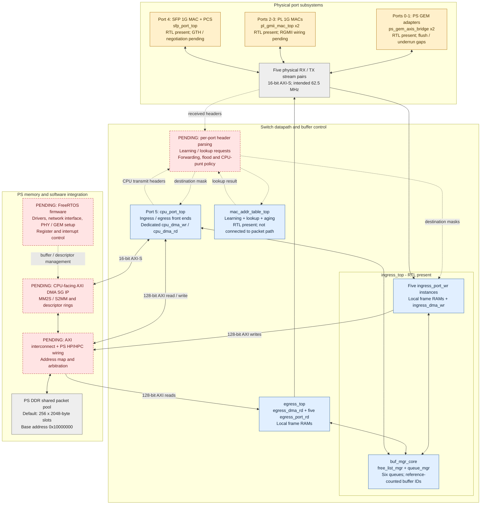
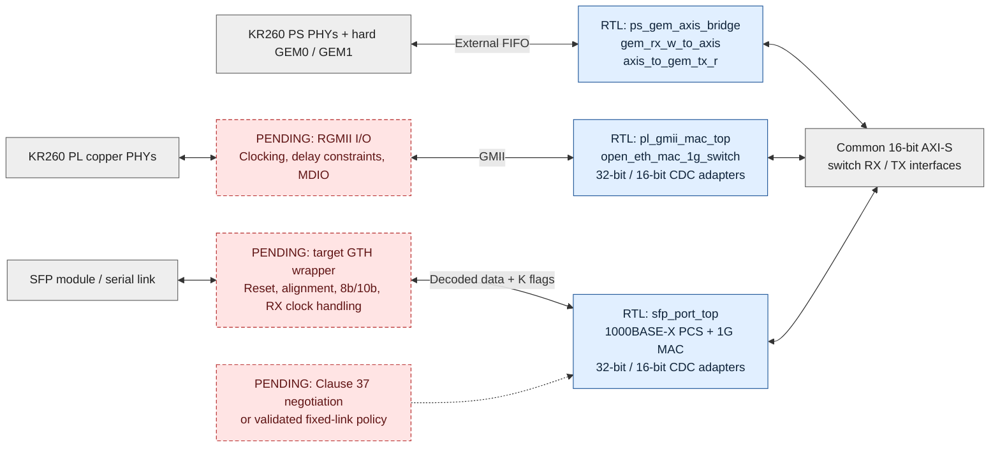

# Overall architecture

Inventory baseline: 2026-09-17. This describes the RTL present in this repository
and the integration still needed to make it a working KR260 switch.

**The implemented architecture is a store-and-forward switch using a shared PS
DDR packet pool.** PS GEM traffic enters PL through the GEM external FIFO
interface, bypassing the GEM's built-in DMA. The switch's own PL DMA engines
then store packets in DDR. These are different DMA paths.

## System view

Blue boxes have RTL in the repository. Amber boxes also have RTL but have
known functional or hardware-integration gaps. Red boxes marked **PENDING**
have no complete implementation here. Gray boxes are interfaces or existing
hardware resources. Arrows show the intended system connections; there is
**no system-level RTL wrapper or Vivado block design wiring this complete
diagram together yet**. Dotted arrows carry forwarding/control information.

Also pending across the whole diagram: board top level, clock generation,
reset sequencing, pin/timing/CDC constraints, management-register access, and
an end-to-end switch testbench.

## Physical-port boundaries

This diagram separates existing digital adapters from the missing board-level
pieces. Each double arrow represents receive and transmit paths.

The SFP PCS operates at a decoded 8-bit, 125 MHz boundary. It does not contain
the serial transceiver or implement a 10G Ethernet path. Its `sync_ok_o` means
code-group synchronization, not a negotiated or hardware-validated link.

## Packet lifetime

1. A port adapter supplies a frame to `ingress_port_wr` over 16-bit AXI-S.
   The frame is collected in local RAM. An error on the final transfer drops
   it before allocation. Only one frame is in flight per front end.
2. The front end allocates a buffer ID from `buf_mgr_core`. The appropriate
   write DMA copies the frame into `DDR_BASE_ADDR + bufid * BUFFER_BYTES`.
3. A forwarding decision must provide `dest_mask_i` and
   `dest_mask_valid_i`. This producer is still missing; the testbenches supply
   masks directly. The ingress front end waits for the decision before enqueue.
4. `queue_mgr` records the length and links the buffer ID into each selected
   destination queue. `free_list_mgr` tracks the number of destinations. A
   zero mask frees the allocation without forwarding.
5. Each egress front end dequeues a buffer ID and uses its read DMA to copy
   the frame into local RAM. It releases its reference to the DDR slot once
   that copy completes, then streams the local copy to its MAC or CPU endpoint.
6. The shared DDR allocation returns to the free list after the final
   destination releases it. Multicast therefore shares one stored payload,
   with a separate read and local copy for each destination.

The CPU port uses the same front ends and buffer manager, but dedicated
`cpu_dma_wr` / `cpu_dma_rd` engines. A separate, not-yet-instantiated AXI DMA
SG block would move data between FreeRTOS-owned buffers and this port's streams.
The current CPU design therefore copies between software buffers and the
switch pool; it is not a direct zero-copy software interface to pool buffers.

## Current interface contract

| Interface | Current RTL contract |
| --- | --- |
| Switch packet streams | 16-bit `TDATA`, two-bit `TKEEP`, `TVALID`, `TREADY`, `TLAST`; low byte first |
| Partial final word | `TKEEP=01`; otherwise `TKEEP=11`. Sparse/empty keep patterns are not supported by the front ends. |
| Ingress error | `TUSER` sampled on the accepted final transfer; PL MAC adapters currently tie it low because the MAC filters bad frames. |
| Frame content | Ethernet header and payload; FCS excluded from switch streams. PS GEM receive configuration must match this convention. |
| Physical DDR access | One shared 128-bit write engine and one shared 128-bit read engine, each arbitrating five ports and allowing one outstanding frame burst |
| CPU switch-pool access | Dedicated 128-bit write/read engines; same pool geometry as physical ports |
| Port mask | Six bits in the buffer manager; eight bits in MAC-table results. Integration must define the mapping and disable unused table ports. |

Clock values in source comments are intended operating points, not timing-closure
results. In particular, the current GEM adapters transfer individual bytes on
their fabric-side FIFO ports, so a 16-bit external interface alone does not
establish 1 Gb/s sustained throughput. See the [inventory gaps](inventory.md#known-gaps-in-existing-rtl).
