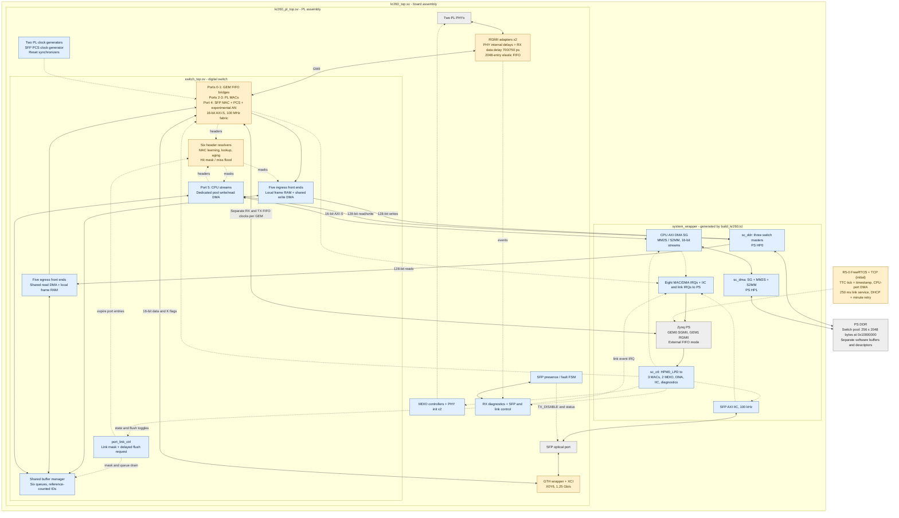

# Overall architecture

Inventory baseline: 2026-09-20. The design is a store-and-forward switch
using a shared PS DDR packet pool. PS GEM traffic enters PL through the GEM
external FIFO interface, bypassing the GEM's built-in DMA. The switch's own
PL DMA engines then store packets in DDR.

## System view

The board assembly and generated block design now connect the port hardware,
switch, and PS memory interfaces. Blue boxes are implemented source/IP
assembly; amber boxes have known functional or verification gaps; red boxes
are pending development. A connection in this diagram means wiring exists,
not that operation has been demonstrated on a KR260.

The local Vivado reports show successful routing and bitstream generation
under the current constraints. Complete external timing and CDC sign-off are
still pending. The portable system test covers a GEM0-to-CPU lookup miss;
all-port forwarding, shared DDR contention, sustained load and hardware
bring-up remain unverified. See [verification](verification.md).

The [initial R5 firmware](../software/r5/README.md) builds against the upstream
FreeRTOS-LTS checkout and generated board BSP. Its network interface uses the
CPU virtual port; hardware execution remains to be validated.

## Physical-port boundaries

| Index | Port | Digital-switch boundary and board connection |
| --- | --- | --- |
| 0–1 | PS GEM0 / GEM1 | External FIFO signals, separate RX/TX clocks and synchronized resets per GEM; connected to PS FIFO ports by the block design and static top |
| 2–3 | PL GMII0 / GMII1 | GMII to two RGMII adapters; each has a local 125 MHz MAC clock, PHY RX clock, MDIO controller and reset request |
| 4 | SFP 1G | Decoded 16-bit GTH interface; board wrapper joins the transceiver and a new 125/62.5 MHz PCS clock generator |
| 5 | Virtual CPU | 16-bit AXI-S pair connected to vendor AXI DMA MM2S/S2MM |

`switch_top` exposes four DMA channel groups: physical ingress writes,
physical egress reads, CPU pool writes and CPU pool reads. The board wrapper
combines the CPU groups into one AXI interface, giving `sc_ddr` three masters.
The separate CPU-facing AXI DMA has three memory masters through `sc_dma`.
Both paths reach PS DDR, through HP0 and HP1 respectively.

The control interconnect has eight targets: three MACs, two MDIO controllers,
CPU DMA, SFP IIC and diagnostics. Eight MAC/DMA interrupts use PS IRQ0;
IIC uses IRQ1 bit 0; link events use IRQ1 bit 1. `default_age_i` remains tied to its package default.
SFP sync/negotiation status drives LEDs; sideband status and laser force-off/
fault-lockout controls are CPU-accessible. See the [register map](board-integration.md).

Each MDIO controller runs an automatic DP83867 initialization sequence after
PHY reset release. The RGMII RX data/control pins have 700 ps (PL0) and 750 ps (PL1)
IDELAYE3 delays;
the 300 MHz clock outputs now supply active delay calibration. PHY internal
RX/TX delays are configured for 2.00/1.75 ns. The optional FPGA RX-clock delay
remains disabled because its IDELAYE3-to-BUFG path cannot be implemented.

`rgmii_rx_elastic` uses a 2048-entry FIFO36E2, a 64-word startup cushion and
idle-only rate adjustment above 128 words, preserving at least eight idle
words. Overflow/underrun events reach CPU-visible sticky diagnostics.
Separate tests exercise modeled clock offsets; hardware margins and abnormal
recovery remain unverified.

`async_fifo` now selects XPM in synthesis and the portable Gray-pointer model
otherwise. Their reset/capacity details differ. The MAC now synchronizes resets
per domain and publishes data read pointers one word per clock. See
[CDC review](cdc-review.md) for assumptions and remaining verification.

The SFP uses 1000BASE-X at 1.25 Gb/s serial rate. Its 125 MHz codec and
62.5 MHz gearbox clocks now come from one MMCM driven by GTH TXUSRCLK2.
The gearbox now transfers complete words across these related clocks and
passes four-phase simulation. GTH startup is verified; receive clock correction
and hardware packet operation are under [investigation](sfp-debug.md). This is not a 10G datapath.

Experimental Clause 37 negotiation overrides transmitted MAC symbols and
exports link/duplex/pause/fault status. It does not gate frame admission;
frames accepted during negotiation/restart can be lost or truncated. The board
overrides short simulation timers with 10 ms restart and 10 ms acknowledge/idle
intervals; compatibility, fault, idle stability and pause rules remain incomplete. Two-PCS tests share clocks and the same RTL; they
do not establish independent-peer interoperability. See the
[development backlog](inventory.md#modules-and-integration-still-pending).

## Packet lifetime

1. A port adapter supplies a frame to `ingress_port_wr` over 16-bit AXI-S.
   The frame is collected in local RAM. An error on the final transfer drops
   it before allocation. Only one frame is in flight per front end.
2. The front end allocates a buffer ID from `buf_mgr_core`. The appropriate
   write DMA copies the frame into `DDR_BASE_ADDR + bufid * BUFFER_BYTES`.
3. In parallel with frame reception, each `mac_addr_resolver` snoops accepted
   words to capture destination/source MACs and request lookup/learning. A hit
   returns the learned mask with the ingress port removed; a same-port-only
   hit drops the frame rather than flooding. A miss floods all other ports
   (including CPU for physical ingress).
   `mac_forwarding_top` supplies `dest_mask_i` / `dest_mask_valid_i`; ingress
   waits for a valid decision before enqueue. Learning currently precedes
   final frame validation; see the [resolver gaps](inventory.md#known-gaps-in-existing-rtl).
4. `queue_mgr` masks the forwarding decision with the CPU-maintained link-up
   bits, then records the length and links the buffer ID into each selected
   destination queue. `free_list_mgr` tracks the number of destinations. A
   zero mask frees the allocation without forwarding.
5. Each egress front end dequeues a buffer ID and uses its read DMA to copy
   the frame into local RAM. It releases its reference to the DDR slot once
   that copy completes, then streams the local copy to its MAC or CPU endpoint.
6. The shared DDR allocation returns to the free list after the final
   destination releases it. Multicast therefore shares one stored payload,
   with a separate read and local copy for each destination.

The CPU port uses the same front ends and buffer manager, but dedicated
`cpu_dma_wr` / `cpu_dma_rd` engines. The block design instantiates a separate AXI DMA
SG block to move data between FreeRTOS-owned buffers and this port's streams.
The current CPU design therefore copies between software buffers and the
switch pool; it is not a direct zero-copy software interface to pool buffers.

## Current interface contract

| Interface | Current RTL contract |
| --- | --- |
| Switch packet streams | 16-bit `TDATA`, two-bit `TKEEP`, `TVALID`, `TREADY`, `TLAST`; low byte first |
| Partial final word | `TKEEP=01`; otherwise `TKEEP=11`. Sparse/empty keep patterns are not supported by the front ends. |
| Ingress error | `TUSER` sampled on the accepted final transfer; PL MAC adapters currently tie it low because the MAC filters bad frames. |
| Frame content | Ethernet header and payload; FCS excluded from switch streams. PS GEM receive configuration must match this convention. |
| Physical DDR access | One shared 128-bit write engine and one shared 128-bit read engine, each arbitrating five ports and allowing one outstanding frame burst |
| CPU switch-pool access | Dedicated 128-bit write/read engines; same pool geometry as physical ports |
| Port mask | Six bits in the buffer manager; eight bits in MAC-table results. `mac_forwarding_top` uses bits 0–5 and disables request ports 6–7. |

The GEM RX bridge packs bytes before crossing into the fabric; TX unpacks
after crossing into the GEM clock domain. TX starts after 128 words or the
frame's final word is buffered. Both PL/SFP adapters now transfer one 16-bit
word per cycle, with 256-word (512-byte payload) FIFOs. The physical ingress
DMA now sustains one 128-bit beat per cycle after pipeline fill when AXI
is ready. Two buffered words with reserved space for each pending RAM read
keep data stable during backpressure. CPU ingress remains three cycles per
beat. Egress
prefetches the next RAM beat to stream without the former beat-boundary gaps.

## Port state and link-down handling

`rx_diag_regs` resets the six-bit link mask to CPU-only (`0x20`): **all physical
ports are excluded as enqueue destinations until software marks them up**.
MDIO polls report physical link, speed and duplex; SFP sources report changes.
These events raise a maskable interrupt but do not automatically modify the
software link mask. Firmware must evaluate status and use LINK_SET/LINK_CLR.

`port_link_ctrl` synchronizes levels/toggles into the fabric and delays each
flush pulse four cycles. `queue_mgr` masks new destinations and drains queued
references through the free-list arbiter. The MAC-table sweep removes the
port's bits and expires entries whose masks become empty. Already-dequeued
frames and MAC/GEM FIFO contents are not aborted; ingress and learning are
not disabled by this output mask. Busy is status, not a command acknowledgement.
Rapid repeated toggles, link-up before flush completes, ongoing learning and
in-flight traffic need further testing. The register map is in
[board integration](board-integration.md#link-control-and-events).

### Control-protocol hooks (STP/LACP/LLDP) and the STP implementation

The hardware traps and gates traffic needed to run STP (and, generically,
any other IEEE 802.1D "Slow Protocol" that addresses frames to the reserved
Bridge Group block) as protocol-agnostic primitives — none of the hardware
described in this subsection parses a BPDU, elects a root, or runs a timer.
As of 2026-09-23 those primitives ARE used by a real classic (802.1D-1998,
not RSTP/MSTP) STP implementation in firmware (`software/r5/src/stp.c` +
`stp_task.c`), described in its own subsection below. LACP and LLDP remain
unimplemented; the same hooks are available for a future task to use the
same way.

**Reserved address trap.** Each per-port `mac_addr_resolver` instance
(inside `mac_forwarding_top`) compares every frame's destination MAC
against the fixed 44-bit prefix `01:80:C2:00:00:0x` (IEEE 802.1D's
Bridge Group Address block, covering STP/RSTP/MSTP, LACP/OAM Slow
Protocols, LLDP nearest-bridge and others in one compare). A match forces
`dest_mask` to the CPU port only, regardless of the MAC table, and asserts
a per-port `ctrl_frame_o`. This trap is unconditional — not gated by
`fwd_en_i`/`learn_en_i` below, and not software-disableable — since the
reserved range has no legitimate reason to ever be flooded or forwarded to
another port.

**`fwd_en_i` / `learn_en_i` (per physical port, `mac_forwarding_top` /
`switch_top`).** These add the two 802.1D port-state gates the existing
`link_up_i`/link-flush mechanism above does not provide:

- `fwd_en_i[n]=0` makes port `n`'s resolver return an empty `dest_mask` for
  ordinary traffic (nothing is relayed from or to that port), independent
  of physical link state.
- `learn_en_i[n]=0` suppresses `learn_req_o` for that port (source MACs
  are not entered into the table), also independent of link state.
- Both gates are bypassed for control-block frames — a "blocking" port
  under `fwd_en_i=0` still delivers its BPDUs/LACPDUs/LLDPDUs to the CPU,
  which is required for STP to ever transition a blocked port back to
  forwarding.

Firmware controls these through four new `rx_diag_regs` write-1-to-set /
write-1-to-clear registers (`FWD_SET`/`FWD_CLR`/`LEARN_SET`/`LEARN_CLR` at
offsets `0x38`/`0x3C`/`0x40`/`0x44`) and reads combined status back from
`PORT_CTRL_STATUS` (`0x48`). Both default to all-ports-enabled out of
reset, so the system behaves exactly as before this feature on any
firmware that never touches these registers. The bits cross into the
fabric clock domain through a plain double-flop synchronizer (level
signals, not pulsed), matching this design's existing CDC conventions —
see [cdc-review](cdc-review.md).

**CPU TX destination override (`switch_top`).** Previously CPU-originated
frames could only be resolved by the same automatic per-port
`mac_addr_resolver` (PORT_ID=5) every physical port uses — learned-unicast
or flood, with no way to target one specific egress port. A control
protocol needs exactly that (send a BPDU/LACPDU out one port only).
`CPU_TX_OVERRIDE` (`0x4C`, bit31=go, bits5:0=destination port mask)
crosses into the fabric clock domain through the new generic
`ctrl_value_xdomain` module (a one-shot value+toggle crossing, documented
in the module itself) and arms a one-shot latch inside `switch_top` that
substitutes the software-chosen mask for `cpu_port_top`'s normal
`dest_mask_i`/`dest_mask_valid_i` on exactly the next frame the CPU
enqueues, then disarms automatically. An un-overridden CPU frame resolves
normally, so this has no effect on ordinary CPU traffic (management, DHCP,
ARP, etc.).

**Firmware plumbing (`software/r5/src/pstate.c`, `pstate.h`).** Thin
register-access wrappers only — `pstate_fwd_set/clear`,
`pstate_learn_set/clear`, `pstate_get`, and `pstate_cpu_tx_raw` (arms the
override, then calls the existing `fabric_dma_send`). `network.c`'s RX
loop pre-filters frames addressed to the reserved block before they reach
`eConsiderFrameForProcessing` (which would otherwise silently discard
them, since they don't match the board's own MAC or IP/ARP EtherTypes) and
hands them to a weak, default-no-op hook, `fabric_ctrl_frame_rx` — now
overridden by `stp_task.c` (see below); LACP/LLDP remain unimplemented and
would need their own override of the same weak hook.

**CPU RX ingress-port tag.** The one hardware gap STP genuinely needed:
the CPU's inbound frame path (`buf_mgr_core`/`queue_mgr` → `egress_top` →
the shared CPU AXI DMA) had no way to tell software which of the 5
physical ports a delivered frame actually arrived on — all of them funnel
into one shared CPU RX queue. `buf_mgr_pkg`'s per-buffer metadata (already
carrying `length` end-to-end) now also carries a 3-bit ingress-port tag,
set to each physical port's own fixed `PORT_ID` at enqueue time
(`ingress_top.sv`) and read back at CPU dequeue time. `switch_top.sv`
pushes it into a small `async_fifo` (`clk` → `axis_clk`, depth 16, one
entry per frame handed to the CPU, in delivery order) that
`rx_diag_regs`'s new `CPU_RX_TAG` register (`0x50`) pops on every read.
`fabric_dma.c` reads this register exactly once per RX descriptor it
retires (well-formed or not) to stay in lockstep, and exposes it as
`fabric_dma_last_rx_tag()`. This is a generically useful hook (works for
any CPU-delivered frame, not just trapped control-block ones), not
STP-specific.

#### STP implementation (firmware, 2026-09-23)

`software/r5/src/stp.c`/`include/stp.h` implement the classic 802.1D-1998
Spanning Tree Protocol: Config/TCN BPDU encode-decode, the fixed-
configuration root/designated/blocking election (comparing
{root ID, root path cost, sender bridge ID, sender port ID} tuples), and
the Blocking → Listening → Learning → Forwarding progression driven by the
four standard timers (Hello 2s, Max Age 20s, Forward Delay 15s, inherited
from the root once one is known). It has no `board.h`/FreeRTOS dependency
— host-testable like `policy.c`. A three-bridge triangle regression
(`tests/test_stp.c`) elects one root and blocks one port in that topology;
this does not establish general protocol conformance. A deliberate
simplification: TCN BPDUs are counted but not propagated (no network-wide
fast-aging on topology change) — see `stp.h`'s header for why.

`stp_task.c` is the hardware glue: a 1 Hz FreeRTOS task that polls
`board_ports_get()`/`board_ports_snapshot()` for per-port admission and
speed (mapped to 802.1D path cost: 4/19/100 for 1000/100/10 Mb/s), drives
`FWD_EN`/`LEARN_EN` through `pstate.c` from each recompute's desired mask
(diffed against the last-applied mask, so an unchanged port is never
re-written — `FWD_CLR`/`LEARN_CLR` also flush the port, so a spurious
repeated write would flush it every second and prevent MAC learning from
ever settling), and transmits BPDUs via `pstate_cpu_tx_raw`. It supplies
the strong override of `fabric_ctrl_frame_rx`, reads the frame's ingress
port via `fabric_dma_last_rx_tag()`, and feeds it to `stp_rx_bpdu()`. Live
status (bridge/root IDs, root path cost, and per-port role/state/BPDU
counters) is exposed through `/api/statistics`'s new `"stp"` JSON object
and rendered on the web statistics page — the way to visually confirm STP
is running and converged on real hardware.

**Defaults disabled (2026-09-23).** `stp_task.c`'s `stp_enabled` static
starts `false` and there is currently no web control or persistent
configuration to change it (both explicitly future work) — the only way
to turn it on today is editing that initializer and rebuilding. While
disabled the task touches no hardware at all (no `FWD_EN`/`LEARN_EN`
writes, no BPDU transmit/receive processing), ordinary forwarding remains enabled, while reserved control frames
are still trapped to the CPU and discarded; `stp_get_enabled()`/
`stp_set_enabled()` exist as the entry point the pending web control will
call, restoring all-enabled hardware state on disable and reinitializing
the engine fresh on enable. A real bug was found exercising this feature
against a genuine STP-speaking neighbor switch and is worth knowing about
if extending `stp_task.c` further: `fabric_dma_send()` needed a mutex once
a second CPU-TX caller (BPDU transmission) existed alongside the IP
stack's own output path — see [verification](verification.md)'s
"real bug: CPU TX race" entry.

Remaining TX-override serialization, shared STP task-state, CDC and CPU RX
tag risks are recorded in [verification](verification.md#2026-09-23-check-in-review-remaining-stp-limitations).

## Switch-fabric bandwidth limitations and areas to investigate

Status: updated 2026-09-22 for the pipelined physical ingress write engine
(one beat per cycle after fill). Fabric clock is 100 MHz, and per-port stream
stages transfer one word per cycle. **The DDR throughput estimates below are analytical, not measured system
performance.** A single-port MAC loopback bench measures frame integrity and
GMII gaps; no bench exercises sustained traffic on several ports through a
realistic shared-memory model. Figures marked "assumed" use an
assumed 30-cycle (300 ns) latency for both an AXI read (address to first data) and
a write response (last data to response) through SmartConnect, the PS HP0 port
and DDR, plus about 6 cycles of state overhead per frame.

### Raw capacity (128-bit AXI, 100 MHz fabric)

| Path | Data-phase ceiling | Notes |
| --- | --- | --- |
| HP0 port, per direction | 12.8 Gbit/s (1.6 GB/s) | Shared by ingress writes, egress reads and the CPU-port master; DDR is also shared with the PS |
| Ingress write master | 12.8 Gbit/s (1.6 GB/s) | 1 cycle per 16-byte beat after pipeline fill, with AXI ready; one burst outstanding |
| Egress read master | 12.8 Gbit/s | 1 beat per cycle; one burst outstanding |
| Per-port egress stream out of `egress_port_rd` | 1.6 Gbit/s | One word per cycle; the next 128-bit beat is prefetched while the current one drains (it was 8 words per 10 cycles) |
| PL/SFP port adapters, each direction | 1.6 Gbit/s | Word-wide FIFOs (`switch_egress_to_mac_txd.sv`, `mac_rxd_to_switch_ingress.sv`): one 16-bit word per fabric cycle on the fabric side and per MAC-clock cycle on the MAC side (2.3 Gbit/s). This replaced a byte-serial version that limited each port to 0.8 Gbit/s (0.5 Gbit/s at 62.5 MHz). |
| CPU-port AXI DMA (32-bit) | 3.2 Gbit/s | Separate HP1 path |
| `cpu_dma_wr.sv` | 4.27 Gbit/s | Still 3 cycles per beat |
| Aggregate offered load | 5 Gbit/s | 5 physical ports at 1 Gbit/s; flooded frames multiply the egress side |

### Ingress limitations

0. **(Fixed) byte-serial MAC receive adapter**: `mac_rxd_to_switch_ingress.sv` used to
   move one byte per cycle (0.8 Gbit/s per port at 100 MHz, 0.5 at 62.5 MHz) and could
   not sustain the wire rate. It is now word-wide, and `tb_mac_adapters.sv` checks one
   word per fabric cycle. The MAC's data path itself is 32 bits at 142.86 MHz.
1. **Store-and-forward, one frame in flight per port** (`ingress_port_wr.sv`):
   `s_axis_tready` is low from the end of a frame until its DMA and enqueue finish.
   The adapter FIFO (`mac_rxd_to_switch_ingress.sv`) holds 256 16-bit words
   (512 payload bytes, about 4.1 us at 1 Gb/s), in addition to the MAC
   packet/descriptor storage. A minimum-size frame is 0.67 us on the wire, and the port's turnaround
   (buffer allocation, waiting for the shared write master, the burst, the write
   response, the enqueue) is likely several us when other ports are also waiting,
   so back-to-back small frames or a busy master can exhaust the available
   receive buffering. The adapter honors full by deasserting MAC-stream ready;
   validate the MAC's whole-frame drop behavior once its own storage fills.
2. **One shared write master** serves all five ports and holds the bus for a whole
   frame burst; other ports wait. One burst outstanding means every frame pays the
   write-response latency.
3. **Beat cadence (improved)**: the physical ingress engine now transfers one
   beat per cycle after filling its two-word buffer, rather than alternating
   RAM read and AXI write cycles. For 1,500 bytes (94 beats), the no-stall
   simulation measures 96 cycles from AW acceptance to the final W handshake,
   versus 188 before. This excludes address waiting, response latency and
   frame arbitration/enqueue overhead. Small-frame throughput remains sensitive
   to these fixed costs; sustained multiport bandwidth remains unmeasured.
4. **Buffer pool**: `NUM_BUFFERS = 256` buffers of 2 KiB (512 KiB). The buffer test verifies all 256 slots can be allocated after flush/release
   races. Sustained traffic through pool exhaustion and recovery remains untested.
5. **Serialized control plane**: `queue_mgr` and `free_list_mgr` each process one
   operation at a time (enqueue, dequeue, flush, alloc, release). My estimate is
   about 8 cycles for a unicast enqueue plus about 3 per extra flood destination.
   At small-frame line rate with flooding this may not keep up; unmeasured.
6. **MAC table**: one lookup engine, one learn engine; a link-down flush sweeps all
   four banks (about 2,950 cycles) and an aging tick arriving meanwhile is skipped.

### Egress limitations

0. **(Fixed) byte-serial MAC transmit adapter** (`switch_egress_to_mac_txd.sv`) and
   two idle cycles between 128-bit beats in `egress_port_rd.sv`: both are gone. The
   adapter is word-wide and the port streams one word per cycle with the next beat
   prefetched (`tb_egress_top.sv` case C and `tb_mac_adapters.sv` check the rate).
   `tb_pl_mac_linerate.sv` runs the real MAC in GMII loopback with back-to-back
   frames at wire rate (12 x 1518 B, 24 x 64 B, 60 x 100 B): every frame arrives
   intact and the gap between frames on the GMII pins stays at 14 clocks or less
   (the MAC's own inter-frame gap is 12).
1. **Store-and-forward, one frame per port** (`egress_port_rd.sv`): the next
   frame is not fetched until the current one has been streamed out.
2. **Transmit buffering** (PL and SFP ports): the fabric stream goes through the
   256-word (512-byte payload) FIFO in `switch_egress_to_mac_txd.sv` and into the MAC's own
   4 KiB transmit buffer (1024 x 32-bit, up to 8 frame descriptors), and the MAC
   starts a frame on the wire only once the whole frame has been committed (TLAST).
   So the MAC's buffer decouples the wire from the fetch: the next frame can be
   fetched and streamed while the current one is on the wire, as long as the buffer
   has room for it (about two maximum-size frames). PS GEM ports have only the
   512-byte bridge FIFO (`axis_to_gem_tx_r.sv`) with its start-permit scheme.
   (An earlier version of these notes predicted a gap between back-to-back large
   frames from the 128-byte FIFO alone; that ignored the MAC's buffer and is
   withdrawn.)
3. **One shared read master, one burst outstanding**: each frame pays the full read
   latency. For 64-byte frames the master could sustain about 2.6 million frames/s
   (assumed), against 7.4 million offered at five-port small-frame line rate,
   before any flood multiplication. About 1.18 GB/s for 1518-byte frames (assumed).
5. **Shared HP0**: ingress, egress and the CPU-port master contend for one HP port
   and for DDR with the rest of the PS.

### Areas for investigation and improvement, roughly by expected value

1. **Measure first.** Add an AXI memory model with realistic read/write latency to
   the integration benches; run sustained five-port line-rate traffic (large, small
   and mixed sizes, with floods); add hardware counters (ingress FIFO overrun,
   no-buffer stalls, per-port frames and bytes, master busy cycles) readable over
   AXI-Lite; capture with an ILA on the AXI masters.
2. **Ingress buffering**: double-buffer the port frame RAM and/or deepen the MAC-side
   RX FIFO so a port can receive while the previous frame drains; define and test
   overflow behaviour (clean drop plus a counter).
3. **Ingress write engine**: physical-port beat pipelining is implemented and
   simulation-tested. Allowing several bursts in flight to hide response latency
   remains future work and requires updating the statistics monitor
   single-outstanding contract. The separate `cpu_dma_wr.sv` remains unoptimized.
4. **Egress read engine**: allow several outstanding reads and overlap the next
   frame's fetch with the current stream (double-buffered frame RAM or a larger
   transmit FIFO). Beat-boundary prefetch is already implemented.
5. **Control plane**: pipeline `queue_mgr` and `free_list_mgr` or split enqueue and
   dequeue engines if the counters show them saturating; check flood cost.
6. **Memory system**: consider a second HP port for egress (HP0 is shared by three
   masters), larger bursts across frames, cache/DDR-controller QoS settings, and the
   pool location relative to other PS traffic.
7. **Clock**: the board fabric is now 100 MHz. Review per-domain timing and
   resource use before any further increase; global routed slack is dominated
   by other paths and does not establish performance headroom.

### Bug found while building the wire-rate test

`open_eth_mac_1g_switch.sv` (the MAC fork) computed "descriptor ring full" as
`(wr_bin - rd_bin) == DEPTH` for both the transmit ring (depth 8) and the receive
ring (depth 16). That expression is evaluated in 32 bits, so once the write pointer
had wrapped past the read pointer the difference went negative and "full" was never
detected: an unsent transmit descriptor could be overwritten (frames on the wire
carried a later frame's data). It only appears with the ring nearly full after
16 descriptors, i.e. sustained bursts of small frames. Both compares now use the
pointer width. The frames-at-wire-rate bench exposes it and passes after the fix.
