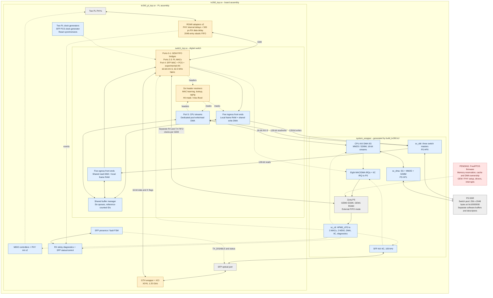

# Overall architecture

Inventory baseline: 2026-09-19. The design is a store-and-forward switch
using a shared PS DDR packet pool. PS GEM traffic enters PL through the GEM
external FIFO interface, bypassing the GEM's built-in DMA. The switch's own
PL DMA engines then store packets in DDR.

## System view

The board assembly and generated block design now connect the port hardware,
switch, and PS memory interfaces. Blue boxes are implemented source/IP
assembly; amber boxes have known functional or verification gaps; red boxes
are pending development. A connection in this diagram means wiring exists,
not that operation has been demonstrated on a KR260.

The local Vivado reports show successful routing and bitstream generation
under the current constraints. Complete external timing and CDC sign-off are
still pending. The portable system test covers a GEM0-to-CPU lookup miss;
all-port forwarding, shared DDR contention, sustained load and hardware
bring-up remain unverified. See [verification](verification.md).

## Physical-port boundaries

| Index | Port | Digital-switch boundary and board connection |
| --- | --- | --- |
| 0–1 | PS GEM0 / GEM1 | External FIFO signals, separate RX/TX clocks and synchronized resets per GEM; connected to PS FIFO ports by the block design and static top |
| 2–3 | PL GMII0 / GMII1 | GMII to two RGMII adapters; each has a local 125 MHz MAC clock, PHY RX clock, MDIO controller and reset request |
| 4 | SFP 1G | Decoded 16-bit GTH interface; board wrapper joins the transceiver and a new 125/62.5 MHz PCS clock generator |
| 5 | Virtual CPU | 16-bit AXI-S pair connected to vendor AXI DMA MM2S/S2MM |

`switch_top` exposes four DMA channel groups: physical ingress writes,
physical egress reads, CPU pool writes and CPU pool reads. The board wrapper
combines the CPU groups into one AXI interface, giving `sc_ddr` three masters.
The separate CPU-facing AXI DMA has three memory masters through `sc_dma`.
Both paths reach PS DDR, through HP0 and HP1 respectively.

The control interconnect has eight targets: three MACs, two MDIO controllers,
CPU DMA, SFP IIC and diagnostics. Eight MAC/DMA interrupts use PS IRQ0;
IIC uses IRQ1 bit 0. `default_age_i` remains tied to its package default.
SFP sync/negotiation status drives LEDs; sideband status and laser force-off/
fault-lockout controls are CPU-accessible. See the [register map](board-integration.md).

Each MDIO controller runs an automatic DP83867 initialization sequence after
PHY reset release. The RGMII RX data/control pins have 500 ps IDELAYE3 delays;
the 300 MHz clock outputs now supply active delay calibration. PHY internal
RX/TX delays are configured for 2.00/1.75 ns. The optional FPGA RX-clock delay
remains disabled because its IDELAYE3-to-BUFG path cannot be implemented.

`rgmii_rx_elastic` uses a 2048-entry FIFO36E2, a 64-word startup cushion and
idle-only rate adjustment above 128 words, preserving at least eight idle
words. Overflow/underrun events reach CPU-visible sticky diagnostics.
Separate tests exercise modeled clock offsets; hardware margins and abnormal
recovery remain unverified.

`async_fifo` now selects XPM in synthesis and the portable Gray-pointer model
otherwise. Their reset/capacity details differ. The MAC now synchronizes resets
per domain and publishes data read pointers one word per clock. See
[CDC review](cdc-review.md) for assumptions and remaining verification.

The SFP uses 1000BASE-X at 1.25 Gb/s serial rate. Its 125 MHz codec and
62.5 MHz gearbox clocks now come from one MMCM driven by GTH TXUSRCLK2.
The fixed-phase gearbox, MMCM-to-GT relationship and receive clock correction
still need hardware validation. This is not a 10G datapath.

Experimental Clause 37 negotiation overrides transmitted MAC symbols and
exports link/duplex/pause/fault status. It does not gate frame admission;
frames accepted during negotiation/restart can be lost or truncated. Timers
still default to eight cycles, with incomplete compatibility, fault, idle
stability and pause rules. Two-PCS tests share clocks and the same RTL; they
do not establish independent-peer interoperability. See the
[development backlog](inventory.md#modules-and-integration-still-pending).

## Packet lifetime

1. A port adapter supplies a frame to `ingress_port_wr` over 16-bit AXI-S.
   The frame is collected in local RAM. An error on the final transfer drops
   it before allocation. Only one frame is in flight per front end.
2. The front end allocates a buffer ID from `buf_mgr_core`. The appropriate
   write DMA copies the frame into `DDR_BASE_ADDR + bufid * BUFFER_BYTES`.
3. In parallel with frame reception, each `mac_addr_resolver` snoops accepted
   words to capture destination/source MACs and request lookup/learning. A hit
   returns the learned mask; a miss floods all other ports (including CPU for
   physical ingress).
   `mac_forwarding_top` supplies `dest_mask_i` / `dest_mask_valid_i`; ingress
   waits for a valid decision before enqueue. Learning currently precedes
   final frame validation; see the [resolver gaps](inventory.md#known-gaps-in-existing-rtl).
4. `queue_mgr` records the length and links the buffer ID into each selected
   destination queue. `free_list_mgr` tracks the number of destinations. A
   zero mask frees the allocation without forwarding.
5. Each egress front end dequeues a buffer ID and uses its read DMA to copy
   the frame into local RAM. It releases its reference to the DDR slot once
   that copy completes, then streams the local copy to its MAC or CPU endpoint.
6. The shared DDR allocation returns to the free list after the final
   destination releases it. Multicast therefore shares one stored payload,
   with a separate read and local copy for each destination.

The CPU port uses the same front ends and buffer manager, but dedicated
`cpu_dma_wr` / `cpu_dma_rd` engines. The block design instantiates a separate AXI DMA
SG block to move data between FreeRTOS-owned buffers and this port's streams.
The current CPU design therefore copies between software buffers and the
switch pool; it is not a direct zero-copy software interface to pool buffers.

## Current interface contract

| Interface | Current RTL contract |
| --- | --- |
| Switch packet streams | 16-bit `TDATA`, two-bit `TKEEP`, `TVALID`, `TREADY`, `TLAST`; low byte first |
| Partial final word | `TKEEP=01`; otherwise `TKEEP=11`. Sparse/empty keep patterns are not supported by the front ends. |
| Ingress error | `TUSER` sampled on the accepted final transfer; PL MAC adapters currently tie it low because the MAC filters bad frames. |
| Frame content | Ethernet header and payload; FCS excluded from switch streams. PS GEM receive configuration must match this convention. |
| Physical DDR access | One shared 128-bit write engine and one shared 128-bit read engine, each arbitrating five ports and allowing one outstanding frame burst |
| CPU switch-pool access | Dedicated 128-bit write/read engines; same pool geometry as physical ports |
| Port mask | Six bits in the buffer manager; eight bits in MAC-table results. `mac_forwarding_top` uses bits 0–5 and disables request ports 6–7. |

The GEM RX bridge packs bytes before crossing into the fabric; TX unpacks
after crossing into the GEM clock domain. Each FIFO therefore transfers a
16-bit word per fabric cycle. TX starts after 128 words or the frame's final
word is buffered, using a Gray-coded permit counter. A 1518-byte line-rate
frame passes both directions in simulation, but sustained six-port throughput,
independent GEM clock drift and arbitrary upstream stalls remain unverified.
