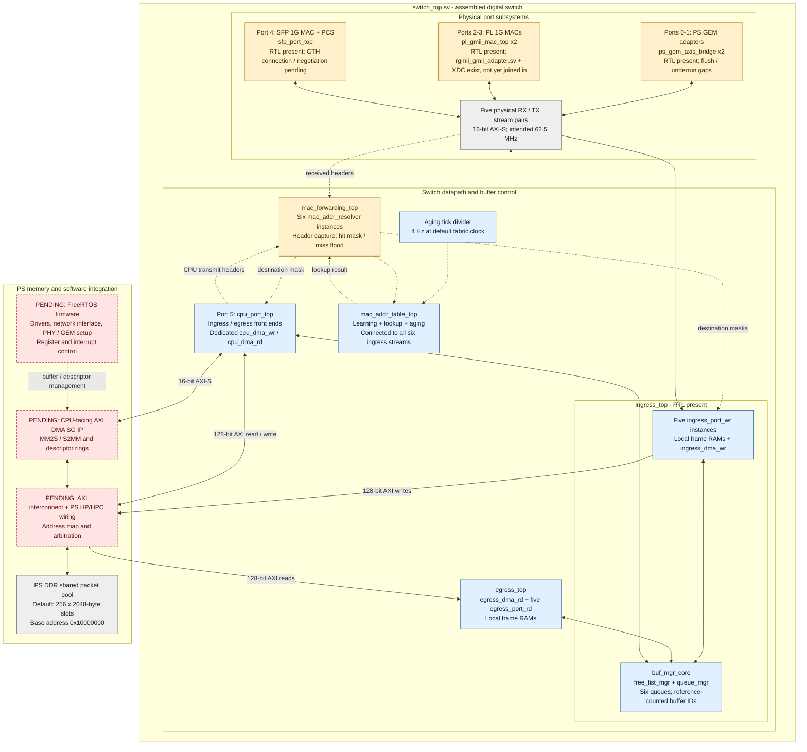
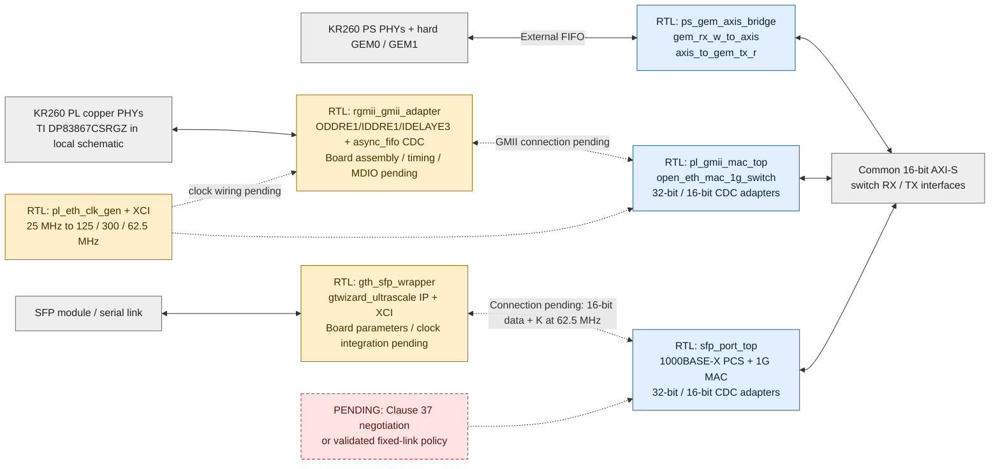

# Overall architecture

Inventory baseline: 2026-09-18. This describes the RTL present in this repository
and the integration still needed to make it a working KR260 switch.

**The implemented architecture is a store-and-forward switch using a shared PS
DDR packet pool.** PS GEM traffic enters PL through the GEM external FIFO
interface, bypassing the GEM's built-in DMA. The switch's own PL DMA engines
then store packets in DDR. These are different DMA paths.

## System view

Blue boxes have RTL in the repository. Amber boxes also have RTL but have
known functional or hardware-integration gaps. Red boxes marked **PENDING**
have no complete implementation here. Gray boxes are interfaces or existing
hardware resources. **`switch_top.sv` now joins the port subsystems, forwarding
logic and shared-buffer datapath.** Its external DDR masters, CPU streams,
GMII pins and SFP parallel pins still need board/platform integration. Arrows
to pending blocks show intended connections. Dotted arrows carry control data.

Also pending across the whole diagram: board top level, integration of the
existing PL clock generators, remaining clock/reset sources, timing/CDC
constraints, and management-register access. PL pin constraints now exist.
A GEM0-to-CPU smoke test exists; coverage of all ports, learned forwarding,
shared DDR arbitration, and sustained load remains pending.

## Physical-port boundaries

This diagram separates existing digital adapters from the missing board-level
pieces. Each double arrow represents receive and transmit paths.

The RGMII adapter implements DDR I/O, optional receive-clock delay, and a
receive FIFO crossing into the MAC clock domain. Its separate behavioral
model tests nibble/control encoding but omits that FIFO and physical timing.
PL package-pin and input-clock constraints exist; complete external timing,
MDIO control, PHY initialization, and board-level assembly remain pending.

`pl_eth_clk_gen` and its Clocking Wizard configuration generate nominal
125 MHz MAC, 300 MHz delay-reference, and 62.5 MHz fabric clocks from 25 MHz.
The proposed assembly uses two instances, with PL0's 62.5 MHz output supplying
the shared switch clock and PL1's corresponding output unused. Neither clock
generator nor RGMII adapter is instantiated by `switch_top` yet.

The local carrier schematic identifies TI DP83867 PHYs, one buffered 25 MHz
source shared by both PL reference inputs and PHY XI pins, and PHY reset
requests routed through U19. See [board integration](board-integration.md) for
the clock diagram, sheet references, revision scope, and remaining checks.
Prior isolated Vivado synthesis is reported in source comments; no reproducible
scripts/reports are committed, and those checks were not rerun for this inventory.

The SFP PCS now exposes decoded 16-bit data plus two K/error flags at
62.5 MHz. Its internal GMII/symbol logic remains at 125 MHz; the two-phase
gearbox assumes exactly 2:1, phase-related clocks. These are not independent
clock domains. The board design must generate and constrain that relationship.

`gth_sfp_wrapper.sv` instantiates the vendor `gth_sfp_ip` from the checked-in
Transceiver Wizard configuration. Neither `sfp_port_top` nor `switch_top`
instantiates the GTH wrapper. Its channel X0Y4 and 125 MHz reference clock are
placeholders. The local schematic shows a 156.25 MHz SFP reference, requiring
IP reconfiguration and channel/pin confirmation. Generated IP output products and
a reproducible board build are not included. Source comments report prior
Vivado/UNISIM elaboration; this inventory did not rerun or independently
establish that result.

The standalone `gth_sfp_sim_model` test checks delayed parallel loopback,
reset/status and error injection. The PCS and full SFP-port tests instead
connect their parallel pins directly; they do not use the GTH model or
validate a serial link. Neither implementation provides 10G Ethernet.
`sync_ok_o` indicates code-group synchronization, not a negotiated link.

## Port map and external integration

| Index | Port | Boundary exposed by `switch_top` |
| --- | --- | --- |
| 0–1 | PS GEM0 / GEM1 | GEM external FIFO signals and one clock/reset pair per GEM |
| 2–3 | PL GMII0 / GMII1 | GMII signals; `rgmii_gmii_adapter.sv` + `constraints/kr260_pl_ethernet.xdc` exist for the carrier RGMII conversion but aren't joined into `switch_top` yet |
| 4 | SFP 1G | Decoded 16-bit GTH parallel signals; transceiver wrapper remains external |
| 5 | Virtual CPU | 16-bit AXI-S pair for future CPU-facing AXI DMA |

Four separate AXI master channel groups leave the top: physical ingress writes,
physical egress reads, CPU pool writes, and CPU pool reads. The three MAC
AXI-Lite interfaces and `default_age_i` also remain external. There is no
CPU-accessible management register map or PS block design yet.

## Packet lifetime

1. A port adapter supplies a frame to `ingress_port_wr` over 16-bit AXI-S.
   The frame is collected in local RAM. An error on the final transfer drops
   it before allocation. Only one frame is in flight per front end.
2. The front end allocates a buffer ID from `buf_mgr_core`. The appropriate
   write DMA copies the frame into `DDR_BASE_ADDR + bufid * BUFFER_BYTES`.
3. In parallel with frame reception, each `mac_addr_resolver` snoops accepted
   words to capture destination/source MACs and request lookup/learning. A hit
   returns the learned mask; a miss floods all other ports (including CPU for
   physical ingress).
   `mac_forwarding_top` supplies `dest_mask_i` / `dest_mask_valid_i`; ingress
   waits for a valid decision before enqueue. Learning currently precedes
   final frame validation; see the [resolver gaps](inventory.md#known-gaps-in-existing-rtl).
4. `queue_mgr` records the length and links the buffer ID into each selected
   destination queue. `free_list_mgr` tracks the number of destinations. A
   zero mask frees the allocation without forwarding.
5. Each egress front end dequeues a buffer ID and uses its read DMA to copy
   the frame into local RAM. It releases its reference to the DDR slot once
   that copy completes, then streams the local copy to its MAC or CPU endpoint.
6. The shared DDR allocation returns to the free list after the final
   destination releases it. Multicast therefore shares one stored payload,
   with a separate read and local copy for each destination.

The CPU port uses the same front ends and buffer manager, but dedicated
`cpu_dma_wr` / `cpu_dma_rd` engines. A separate, not-yet-instantiated AXI DMA
SG block would move data between FreeRTOS-owned buffers and this port's streams.
The current CPU design therefore copies between software buffers and the
switch pool; it is not a direct zero-copy software interface to pool buffers.

## Current interface contract

| Interface | Current RTL contract |
| --- | --- |
| Switch packet streams | 16-bit `TDATA`, two-bit `TKEEP`, `TVALID`, `TREADY`, `TLAST`; low byte first |
| Partial final word | `TKEEP=01`; otherwise `TKEEP=11`. Sparse/empty keep patterns are not supported by the front ends. |
| Ingress error | `TUSER` sampled on the accepted final transfer; PL MAC adapters currently tie it low because the MAC filters bad frames. |
| Frame content | Ethernet header and payload; FCS excluded from switch streams. PS GEM receive configuration must match this convention. |
| Physical DDR access | One shared 128-bit write engine and one shared 128-bit read engine, each arbitrating five ports and allowing one outstanding frame burst |
| CPU switch-pool access | Dedicated 128-bit write/read engines; same pool geometry as physical ports |
| Port mask | Six bits in the buffer manager; eight bits in MAC-table results. `mac_forwarding_top` uses bits 0–5 and disables request ports 6–7. |

Clock values in source comments are intended operating points, not timing-closure
results. In particular, the current GEM adapters transfer individual bytes on
their fabric-side FIFO ports, so a 16-bit external interface alone does not
establish 1 Gb/s sustained throughput. See the [inventory gaps](inventory.md#known-gaps-in-existing-rtl).
