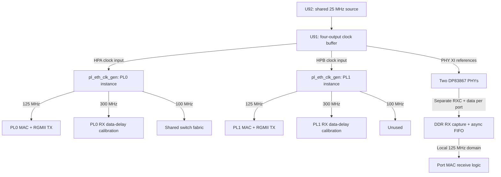

# KR260 board integration status

Production assembly updated 2026-09-25: packaged digital endpoints, fabric
and management now live inside `system.bd`. Physical RGMII, MDIO, GTH,
clock/reset and sideband logic remain in `kr260_pl_top`, preserving board
constraint targets. Register addresses and firmware ABI are unchanged.

The preceding native assembly has been demonstrated on the board with
FreeRTOS, DHCP, CPU/endpoint traffic, SNMP/web and microSD persistence.
The production catalog assembly also passed JTAG deployment, DHCP after
retry, settled CPU/endpoint forwarding and SNMP/web checks on GEM1/PL0. See
[verification](verification.md) for build-specific evidence and timing/CDC
limitations, and [partitioning](ip-partitioning.md) for migration scope.

Management 1.1 now includes the statistics decoder in source and passes fresh
BD/simulation acceptance. It has passed synthesis and PNR (WNS +0.018 ns, hold +0.010 ns),
and is now deployed. GEM1/PL0 sustained pings and SNMP passed. The DHCP retransmission/startup policy is corrected; a short R5 startup gap
and the confirmed HTTP connection-capacity limitation remain open. See
startup-and-http-investigation.md and current verification results.

## Reference material and revision scope

The local AMD XTP743 download contains
`038-05101-01_sck-kr_reva02_SKIT_20211015.pdf`, drawing 038-05101-01,
revision A02, dated 2021-10-15. Its SHA-256 is:

```text
3d9eab500bcacbe20bb98e0820988dcbcecd212cb4f11cb9b68934e4ae7305ad
```

The vendor PDF, archive, and vendor readme remain local under `docs/xtp743/`
and are excluded from Git. Obtain XTP743 through the
[AMD KR260 carrier schematic download](https://www.xilinx.com/member/forms/download/design-license.html?cid=bad0ada6-9a32-427e-a793-c68fed567427&filename=xtp743-kr260-schematic.zip).
These observations describe that drawing; confirm the fitted hardware revision
before applying them to a board.

The installed Vivado 2026.1 board models are under
`data/xhub/boards/XilinxBoardStore/boards/Xilinx/`: carrier
`kr260_carrier/2.0/board.xml` and SOM `kr260_som/2.0/part0_pins.xml`.
They supply interface names and connector-to-package mappings. Their component
metadata is not sufficient to identify the fitted PHY or oscillator topology.

## Schematic findings

| Sheet | Finding | Consequence for this design |
| --- | --- | --- |
| 20–21 | Both PL Ethernet PHYs are TI DP83867CSRGZ. The installed carrier board XML instead names a Marvell part. | Use the TI PHY register definitions for MDIO setup and delay configuration. |
| 16 | U92 supplies 25 MHz to U91, an NB3V1104 1:4 buffer. Outputs feed `HPA_CLK0P_CLK`, `HPB_CLK0P_CLK`, `GEM2_XTAL_IN`, and `GEM3_XTAL_IN`. | The two PL reference inputs share one oscillator in this drawing. They are not two independent oscillator sources. |
| 16 | FPGA nets `HPA05_CCN` and `HPB05_CCN` enter U19 (SLG7XL45106), which outputs the two PL PHY resets. | The XDC's `phy_reset_n` ports are reset requests into the sequencer. Establish its actual reset behavior during bring-up. |
| 16 | U90 supplies a 156.25 MHz differential reference on `GTH_REFCLK0_C2M_P/N` for SFP+. | The GTH IP now selects 156.25 MHz. Its 1.25 Gb/s line rate and 16-bit user width remain unchanged. The nearby U87 125 MHz source feeds PS GTR, not SFP GTH. |
| 14 / 7 | SFP TD_P/N and RD_P/N use `GTH_DP2_M2C_P/N` and `GTH_DP2_C2M_P/N`. The SOM map gives TX R4/R3, RX T2/T1 and reference Y6/Y5 (P/N). | The IP now selects X0Y6 for channel and TX/RX masters. The wrapper header reports a Vivado site check resolving the serial pins to GTHE4_CHANNEL_X0Y6 and reference pins to GTHE4_COMMON_X0Y1. This inventory checked the XCI and SOM pin map; vendor-tool validation was not rerun. |

## PL pin and clock plan

[`kr260_pl_ethernet.xdc`](../constraints/kr260_pl_ethernet.xdc) provides the
following mapping, plus the RGMII data/control, MDIO/MDC, and reset-request pins:

| Project port | Board interface | Bank | 25 MHz reference pin | RGMII RX clock pin |
| --- | --- | --- | --- | --- |
| PL0 / switch port 2 | PL GEM2 / HPA | 66 | C3 | D4 |
| PL1 / switch port 3 | PL GEM3 / HPB | 65 | L3 | K4 |

The board assembly uses two instances of
[`pl_eth_clk_gen`](../rtl/pl_gmii/pl_eth_clk_gen.sv). Each wraps the same
[`Clocking Wizard configuration`](../rtl/pl_gmii/ip/pl_eth_clk_gen_ip.xci).
Its configured ratios are input divide 1, feedback multiply 60, and output
divides 12, 5, and 15: a nominal 1500 MHz VCO yields 125, 300, and 100 MHz.
This describes the checked-in configuration, not measured hardware clocks.



Each output has reset release synchronized to its own clock after MMCM lock.
PL0's 100 MHz clock/reset drives the switch fabric, switch DDR masters,
CPU AXI DMA, both DDR SmartConnects and PS HP interface clocks. PL1's
100 MHz output is unused. The 300 MHz outputs calibrate the active RX data/control IDELAYE3 stages.
FPGA RX clock delay remains disabled.

| Clock | Source | Consumers |
| --- | --- | --- |
| 125 MHz per PL port | Each PL MMCM, from its 25 MHz input | MAC and RGMII TX; local RX FIFO read side |
| PHY RXC per PL port | Each external PHY | RGMII DDR receive and FIFO write side |
| 300 MHz per PL port | Each PL MMCM | RX data/control IDELAYE3 calibration |
| 100 MHz fabric | PL0 MMCM | Switch, DDR masters/interconnects, CPU DMA and HP0/HP1 clocks |
| About 142.857 MHz | PS PL0 output, requested as 150 MHz | MAC/MDIO AXI-Lite, HPM0_LPD and control interconnect |
| 50 MHz | PS PL1 output | GTH reset/calibration free-running clock |
| GEM0/1 RX and TX FIFO clocks | Four separate buffered PS outputs | Corresponding bridge RX/TX halves; per-domain `rst_sync` |
| SFP 125 / 62.5 MHz | SFP MMCM from GTH 62.5 MHz TXUSRCLK2 | Codec/MAC and PCS gearbox respectively |

[`sfp_pcs_clk_gen`](../rtl/sfp_pcs/sfp_pcs_clk_gen.sv) wraps a
[third IP configuration](../rtl/sfp_pcs/ip/sfp_pcs_clk_gen_ip.xci).
Its VCO is 1187.5 MHz (62.5 x 19), with output divisors 9.5 and 19.
The two PCS clocks retain synchronous timing checks. The [SFP investigation](sfp-debug.md)
verified startup after selecting TX-derived GTH user clocks, corrected gearbox
word pairing and enabled receive clock correction. Hardware packet validation
and recovery checks remain pending.

Sharing an oscillator does not eliminate the receive clock-domain crossings.
Each PHY supplies its own RXC; the adapter captures RX data there and transfers
it through a FIFO to its local GMII clock. The two MMCM output sets also need
an explicit timing relationship or safe crossings; identical nominal frequency
alone is insufficient.

## MDIO management interface

[`mdio_controller`](../rtl/mdio/mdio_controller.sv) provides a Clause 22
master with a 32-bit AXI-Lite slave and a physical IOBUF. Its separate
[`portable model`](../rtl/mdio/mdio_controller_sim_model.sv) replaces only
the pin stage with tristate logic. The board assembly uses one controller per
PL MDIO bus; the source records PHY addresses 2 and 3 for PL0 and PL1.
Both controllers are instantiated in `kr260_pl_top`, with registers mapped
through `sc_ctl`; the initial R5 link service reads their hardware-polled status.

| Offset | Register | Current behavior |
| --- | --- | --- |
| `0x00` | CONFIG | PHY address `[4:0]`, PHY register `[12:8]`, write/read direction `[16]` (1 = write) |
| `0x04` | WRITE_DATA | Staged 16-bit data, byte-strobe writable |
| `0x08` | READ_DATA | Live master read shift register; use after completion |
| `0x0C` | CONTROL | Bit 0 starts a transaction; one pending START is remembered during sequencer ownership; START during a CPU transaction is ignored |
| `0x10` | STATUS | Bit 0 BUSY (including initialization), bit 1 sticky DONE, bit 2 sticky ERROR, bit 3 INIT_DONE, bit 4 INIT_FAIL, bit 5 LINK, bits 7:6 SPEED (10/100/1000), bit 8 FULL, bit 9 link-status valid; bits 1–2 are write-one-to-clear |
| `0x14` | CLK_DIVIDER | 16-bit divider, reset value 35; MDC toggles every divider + 1 input clocks while busy |

At the observed 142.857 MHz register clock, the reset value 35 gives about
1.98 MHz MDC (period 72 clocks; 2.08 MHz at 150 MHz). One 64-bit transaction
takes about 32 us. These are calculated rates, not hardware measurements.
Clear old status, configure the transaction, issue START, wait for completion,
and inspect ERROR before consuming data. The master clears READ_DATA on every
START, including writes; it is not a separately retained last-successful-read
register. Keep the divider stable while a transaction is running. There is no
interrupt output or native Clause 45 transaction engine. The automatic PL PHY setup uses Clause 22 indirect extended-register access;
initial software management and PS PHY setup are in `software/r5/src/links.c`;
board validation remains pending.

## SFP negotiation and transceiver integration

The SFP PCS now includes `autoneg_1000base_x` and exports informational
link/duplex/pause/fault status through the switch. Its three timer parameters
default to 8 cycles for simulation; the board supplies 10 ms restart and 10 ms
acknowledgement/idle timers through the enclosing SFP/switch tops.
There is no TX backpressure or frame-boundary coordination while configuration
ordered sets override MAC data. Compatibility/fault rules,
idle detection, and link-down admission policy must be completed before use
with a real peer. See [known RTL gaps](inventory.md#known-gaps-in-existing-rtl).

The GTH wrapper is connected to the SFP pins and PCS clock generator.
SFP IIC and sideband control are now wired; the sections below describe their
registers and behavior. `sfp_led[1:0]` remains `{sync_ok, an_link_up}`. PCS
negotiation duplex/pause/fault outputs are still not mapped to CPU registers.

## Board build and implementation results

The checked-in build inputs are:

- [`build_kr260.tcl`](../build/build_kr260.tcl): creates the project, imports
  three XCI configurations, builds the PS block design and runs the requested
  `bd`, `synth` (default), or `impl` stage.
- [`impl_kr260.tcl`](../build/impl_kr260.tcl): opens the existing synthesized
  project, resets/re-runs implementation through bitstream and writes reports.
  It rejects incomplete runs, debug cores and negative setup/hold slack.
  Normal builds contain no ILAs or debug hub; the separate
  `debug_gem1.tcl` and `debug_sfp.tcl` scripts explicitly add instrumentation.
- [`synth_switch_top.tcl`](../build/synth_switch_top.tcl) and
  [`switch_top_files.f`](../build/switch_top_files.f): out-of-context digital
  switch synthesis; the file list matches `SWITCH_TOP_SRCS` in the Makefile.

The flow targets `xck26-sfvc784-2LV-c` and requires the installed
`xilinx.com:kr260_som:part0:2.0` board preset and vendor IP. The observed tool
version is Vivado 2026.1. From the repository root:

```bash
source /tools/Xilinx/2026.1/Vivado/settings64.sh
vivado -mode batch -source build/build_kr260.tcl -nolog -nojournal -tclargs synth
vivado -mode batch -source build/impl_kr260.tcl -nolog -nojournal
```

`build_kr260.tcl` deletes and recreates `build/vivado_kr260/` on each call,
including with `bd`; preserve any wanted prior results first. `impl_kr260.tcl`
restarts the existing implementation run and checks completion, absence of
debug cores and setup/hold timing. The project-creation script does not yet
validate every run status explicitly; inspect its logs and generated reports.
The bitstream path is
`build/vivado_kr260/kr260_switch.runs/impl_1/kr260_top.bit`.
Reports and generated IP/project products are ignored by Git. An [R5 application and XSA/BSP export flow](../software/r5/README.md) now exist;
boot-image packaging and hardware validation remain pending.

The static [`kr260_top`](../rtl/board/kr260_top.sv) joins generated
`system_wrapper` ports to [`kr260_pl_top`](../rtl/board/kr260_pl_top.sv).
The block design contains the PS, AXI DMA, reset block, interrupt concatenator
and **three SmartConnects**:

| Interconnect | Connection |
| --- | --- |
| `sc_ctl` | PS HPM0_LPD to three MACs, two MDIO controllers, DMA, SFP IIC and diagnostics; two clock domains |
| `sc_ddr` | Physical ingress write, physical egress read and combined CPU pool read/write AXI interfaces to HP0 |
| `sc_dma` | CPU AXI DMA SG, MM2S and S2MM masters to HP1 |

CPU AXI DMA uses scatter-gather, 16-bit streams, 32-bit data memory masters,
DRE on both channels and 16-beat bursts. It copies between software buffers
and the CPU switch port; the switch's dedicated CPU DMA engines separately
copy between that stream and the shared switch pool.

The local routed reports dated 2026-09-20 04:18 show WNS **+0.018 ns**,
WHS **+0.010 ns**, 25,500 LUTs (21.77%), 33,940 registers (14.49%), 51.5 BRAM
tiles and 3/4 MMCMs. A bitstream is present. CDC summary: zero critical,
13 warning and 18 informational clock-pair rows. DRC retains two RAM collision
warnings; methodology retains six missing-delay findings. Thus “constraints
met” is not a claim of warning-free implementation or hardware validation.
These artifacts were inspected, not regenerated by this inventory; source-to-
artifact identity has not been independently established by a clean rebuild.
See [verification](verification.md#local-vivado-implementation-evidence) for
report fingerprints and [CDC review](cdc-review.md) for the recorded analysis.

PS configuration set by the script: GEM0 = SGMII on PS-GTR lane 0 (125 MHz
reference from U87 -- marked `VALUE/DNP TBD` on the schematic, so confirm it is
fitted), GEM1 = RGMII on MIO38-49 with MDIO on MIO50-51, both in external-FIFO
mode; the SOM preset does not configure them. PL0 is requested at 150 MHz but
the PS produces about 142.857 MHz; the AXI-Lite/MAC domain runs there.

| Block | Base address | Size |
| --- | --- | --- |
| CPU AXI DMA | `0x80000000` | 64 KiB |
| MDIO0 (PL0 PHY) / MDIO1 (PL1 PHY) | `0x80010000` / `0x80020000` | 64 KiB each |
| SFP IIC | `0x80030000` | 64 KiB |
| RX/SFP diagnostics | `0x80100000` | 64 KiB |
| PL0 MAC / PL1 MAC / SFP MAC | `0x80040000` / `0x80080000` / `0x800C0000` | 256 KiB each |

The local address report maps each CPU DMA master to DDR `0x00000000`–
`0x7FFFFFFF` and also exposes the PS QSPI aperture. The switch pool
`0x10000000`–`0x1007FFFF` must be reserved separately from software buffers and
descriptor rings. The script relies on automatic mapping for memory windows;
review generated address segments and software cache/ownership rules before use.

PS `pl_ps_irq0[7:0]` receives, in bit order: PL0 `interrupt`, PL0 `mac_irq`,
PL1 `interrupt`, PL1 `mac_irq`, SFP `interrupt`, SFP `mac_irq`, DMA MM2S,
and DMA S2MM. SFP IIC uses `pl_ps_irq1[0]`; link events use `pl_ps_irq1[1]`. Firmware still needs interrupt
routing and service routines.

The implementation changes include separate GEM RX/TX FIFO clocks, XPM
crossings, MAC reset/pointer fixes, PHY delay initialization, and RGMII data
pin delays. Whole-domain `set_max_delay -datapath_only` bounds remain in
`kr260_clocks.xdc`; they depend on the generated clock names and do not prove
protocol correctness. RGMII input/output delays now have their own
implementation-only XDC. Hardware phase/reset behavior remains unverified.

## PHY start-up and RGMII I/O timing

**PHY start-up.** [`phy_init_seq.sv`](../rtl/mdio/phy_init_seq.sv) runs inside
each `mdio_controller` (PHY addresses 2 and 3) on the rising edge of the port's
PHY-reset-request release, so the PHYs are configured without firmware. Sequence,
taken from TI's driver in Xilinx's U-Boot (`dp83867.c`, `dp83867_config`) for
RGMII-ID: check PHYIDR2 = 0xA23x; read STRAP_STS1; PHYCR FIFO depth 1, force-link
cleared (bit 11 cleared only if strapped); CFG4 bit 7 cleared (rxctrl strap
quirk); RGMIICTL[1:0] = 0b11 (internal TX/RX delays on); RGMIIDCTL = {TX 0x6, RX 0x7}.
Extended registers use the REGCR/ADDAR indirect method. While it runs, STATUS.BUSY
reads 1 and one CPU START may be deferred; STATUS[3] = INIT_DONE, STATUS[4] = INIT_FAIL.
Delay codes: Xilinx's device tree uses 0x4 (1.25 ns) for its own MAC; this design
uses RX 0x7 (2.00 ns) and TX 0x6 (1.75 ns), picked from post-route timing (1.25
failed TX setup by 0.48 ns, 2.00 failed TX hold by 0.15 ns).
Checked against the datasheet (`docs/dp83867cs.pdf`, SNLS504G, covers CS/IS/E):
PHYIDR2 default 0xA231; REGCR/ADDAR indirect sequence (0x001F, address, 0x401F,
data); RGMIICTL (0x0032) bits 1:0 = TX/RX clock delay enable (both already default
to 1, and RGMII_EN defaults to 1 for the RGZ package); RGMIIDCTL (0x0086) TX [7:4]
/ RX [3:0] delay codes in 0.25 ns steps (0x6 = 1.75 ns, 0x7 = 2.00 ns); CFG4 bit 7
(INT_TST_MODE_1) must be cleared if RX_CTRL is not strapped to mode 3/4; post-reset
MDC wait is 195 us max (the 2,000,000-clock wait is far longer than needed); MDC
max 25 MHz (ours about 1.98 MHz). Corrections from the datasheet: STRAP_STS1 bit 11 is
STRAP_SGMII_EN (U-Boot calls it reserved), so the sequencer's PHYCR bit-11 clear
forces RGMII if SGMII is strapped; PHYCR FIFO-depth fields only apply in
GMII/SGMII, so writing them is a harmless no-op in RGMII mode. The chosen delay
codes are consistent with the datasheet: RX code 0x7 (2.00 ns) matches the PHY's
nominal TsetupT/TholdT of 2 ns, and TX code 0x6 (1.75 ns) is the closest to the
nominal TskewR of 1.8 ns.
Skipped versus the driver: software reset and restarting auto-negotiation.

**I/O timing.** [`kr260_rgmii_io.xdc`](../constraints/kr260_rgmii_io.xdc)
(implementation only) defines the forwarded TX clocks and RGMII input/output
delays. Numbers are from datasheet section 6.10 (TskewR 1.0-2.6 ns at the PHY input;
TsetupT/TholdT min 1.2 ns at the PHY output): RX input delay
max 2.8 / min 1.2 ns both edges; TX output delay max 3.25 / min 0.85 ns both
edges (derived from the 1.75 ns PHY TX delay). Consequence found in
implementation: with the RX clock on a BUFG the data hold failed by 0.26 ns, so
the RX data/ctl pins now go through `IDELAYE3` (board overrides: PL0 700 ps,
PL1 750 ps; reusable adapter default 500 ps; one IDELAYCTRL instance per port,
IODELAY_GROUP set in the XDC because the attribute cannot take a parameter);
the clock itself is not delayed (IDELAYE3 cannot drive a BUFG). Latest report
figures are recorded above. Delay choices were tuned during development and
need re-evaluation after placement changes. The 2026-09-20 source update reduces
PL1 from 1000 ps to 750 ps; PL0 remains 700 ps. The source comment records
earlier PL1 setup/hold observations of 0.21/0.70 ns at 1000 ps as the tuning
rationale, not as the current routed result. **Margin is thin**; PHY delay
variation and carrier trace skew still need confirmation on hardware.

## SFP module I2C

Checked against the carrier schematic (sheet 13): SFP+ SDA = HDB17 and SCL =
HDB16_CC on SOM240_2 (B50 / B49), i.e. **PL pins** (AC11 / AB11, HD bank 43,
3.3 V), not PS MIO, so a PL master was added rather than enabling a PS I2C. The
carrier fits 4.7 k pull-ups (R334-R339), so the core's open-drain IOBUFs need none.
A Xilinx `axi_iic` (100 kHz, AXI-Lite on the 142.9 MHz control clock) sits behind
`sc_ctl` M06 at **0x8003_0000 (64 KiB)**, its interrupt on `pl_ps_irq1[0]`
(IRQ1 enabled in the PS), pins constrained in `kr260_sfp.xdc` with false paths.
Software uses the standard Vitis `xiic` driver; SFF-8472 EEPROM addresses are
0x50 (A0h) and 0x51 (A2h). Included in the local routed build; see the report summary above.
Not tested on hardware or in simulation (vendor IP, no module fitted in a bench).

## SFP sideband control

`sfp_sideband.sv` (axis_clk) drives TX_DISABLE: off while the module is absent,
through a 10 ms debounce and 300 ms settle after insertion, and while a fault is
being handled. TX_FAULT (debounced 2 ms) drops the laser for 2 ms, re-enables it
and ignores TX_FAULT for 300 ms; after 3 consecutive faults it locks off until
software clears the lockout or the module is removed; the count resets after 5 s
without a fault. LOS is reported only. Registers in the diagnostics block
(0x8010_0000): 0x04 SFP_STATUS (bit0 MOD_ABS, bit1 LOS, bit2 TX_FAULT, bit3
TX_DISABLE driven, bit4 lockout, bit5 fault seen W1C, bit6 removal seen W1C,
[15:8] fault count), 0x08 SFP_CONTROL (bit0 force laser off, bit1 write 1 to leave
lockout). Timings are from SFF-8472/8431 as recalled, not re-checked against the
standards; bench `sim-rx-diag` (tb_sfp_sideband.sv, scaled timers). Not tested
with a real module.

## Link control and events

The diagnostics slave at `0x80100000` now exposes calibration and link control:

| Offset | Register | Behavior |
| --- | --- | --- |
| `0x00` | STATUS | Bits 3:0: PL0 overflow/underrun, PL1 overflow/underrun (W1C); bits 4/5: PL0/PL1 IDELAYCTRL RDY (read-only) |
| `0x04` | SFP_STATUS | Module/LOS/fault, TX_DISABLE, lockout, sticky fault/removal and fault count, as above |
| `0x08` | SFP_CONTROL | Bit 0 force-off; bit 1 write-one clear lockout |
| `0x0C` | LINK_SET | Write-one enables the selected destination ports; reads zero |
| `0x10` | LINK_CLR | Write-one disables ports and toggles a flush request, even if already down; reads zero |
| `0x14` | LINK_STATUS | Bits 5:0 stored port state; bit 8 synchronized queue/MAC flush busy; bits 10/11 PL0/PL1 polled PHY link |
| `0x18` | LINK_EVENT | Sticky W1C: bits 0/1 PL0/PL1 link change, bit 2 SFP negotiation-link change, bit 3 module presence change, bit 4 LOS change, bit 5 TX_FAULT rising |
| `0x1C` | LINK_EVENT_EN | Enables event bits to assert the level interrupt on PS IRQ1 bit 1; reset zero |
| `0x20` | PCS_STATUS | Read-only synchronized SFP state: bit 0 sync, bit 1 negotiation link, bit 2 full duplex, bit 3 remote fault |

LINK_SET/CLR/STATUS use port order GEM0, GEM1, PL0, PL1, SFP, CPU. The reset
mask is **0x20 (CPU only)**. PHY link and SFP events are informational until
software writes the port state. Firmware must check supported speed/duplex;
the PL MAC/RGMII datapath remains fixed at 1G full-duplex even though PHY status
can report lower negotiated speeds.

After initialization, `phy_init_seq` polls PHYSTS about every 10 ms
(`POLL_CYCLES=1430000` at 142.857 MHz), with the first poll after 1000 clocks.
It reports link/speed/duplex and pulses on a link-bit change. Poll errors now invalidate the cached state and clear link-up; PS PHYs are not covered by these controllers. CPU START during
sequencer ownership is a single pending bit, using the current CONFIG/data
when eventually issued. Poll/CPU ownership arbitration, overlapping requests,
reset during a transaction and stale-status recovery still need review.

The switch masks enqueue destinations, drains queued references and sweeps
learned port bits on link-down. It does not purge packets already in egress
RAM/MAC/GEM FIFOs, stop ingress or suppress source learning. The busy bit can
still read zero during request synchronization; it is not an acknowledged
command protocol. Software sequencing for rapid clears and link-up during a
flush remains to be defined and tested.

## IDELAYCTRL / IDELAYE3 reset sequence

Checked against UG571 v1.16 ("Component Mode Reset Sequence", docs/ug571-ultrascale-selectio.pdf)
and DS925 (REFCLK 300-800 MHz, IODELAY clock period >= 3.195 ns, reset pulse >= 52 ns):
EN_VTC is tied high (required in TIME mode while RDY is low); the delay resets and
IDELAYCTRL reset are held until the MMCM is locked; the IDELAYE3 resets are released
first and IDELAYCTRL's 16 refclk cycles later (they were released together before);
the receive path (elastic buffer, diagnostics flags) is released 64 receive-clock
cycles after RDY and re-enters reset if RDY drops. RDY is visible in the diagnostics
register (STATUS bits 5:4). Bench: `xsim-rgmii-idelay-gate` (real primitives) checks
the release order, the 64-cycle hold and the re-reset. In the routed design each port
has two IDELAYCTRL replicas (placed as BITSLICE_CONTROL) on one reset net. Not
checked: the reset nets of any other bitslice controllers Vivado infers for the
transmit ODDRE1s in those banks (UG571: all used controllers in a bank must be
released together); an earlier attempt to hold the delay elements in reset until RDY
was wrong per the sequence and was reverted.

## RGMII receive elastic buffer

`rgmii_rx_elastic.sv` replaces the old 16-entry FIFO between the PHY receive
clock and `gtx_clk` (same nominal 125 MHz, different crystals). It is built on a
2048 x 18 hard FIFO36E2 (`fifo36_async_2kx18.sv`; behavioral model in simulation,
`EXTENDED_DATACOUNT` because place-and-route DRC rejects the other count mode with
independent clocks). The clock difference is absorbed only in the inter-frame gap:
the read side waits for a 64-word cushion outside a frame and never stalls
inside one; the write side drops idle words above 128 buffered but never shortens
the pushed idle run below 8. Overflow (word lost, FIFO full) and underrun (FIFO dry inside a frame,
frame truncated) are reported through `rx_diag_regs.sv`: AXI-Lite slave at
**0x8010_0000** (64 KiB), STATUS at offset 0: bit0 PL0 overflow, bit1 PL0 underrun,
bit2 PL1 overflow, bit3 PL1 underrun; sticky, cleared by writing 1 to the bit
(`sticky_xdomain.sv` carries each flag from its RGMII clock domain, the clear
travels back by a toggle; a read right after the clear sees it cleared; events in
the few cycles before the clear reaches the source domain are lost; if the PHY
receive clock is stopped a clear is not processed until it returns). Bench:
`sim-rx-diag`. Current inventory runs cover Icarus at 0/±500/±3000 ppm and the checked-in
XSim target at +500 ppm using the real FIFO36E2 model. Earlier development
notes also report XSim ±3000 ppm and a failing no-cushion mutation; those
additional configurations are not reproduced by the standard target. Included in the local routed board build. Not measured
against real PHY clocks.

## Remaining implementation and verification

- Validate automatic PHY setup and reset sequencing on the fitted board;
  validate firmware polling and PS PHY/GEM initialization; PL INIT_FAIL still
  requires hardware reset/reinitialization.
- Measure RGMII timing margins, account for board skew and PHY delay variation,
  and review remaining unconstrained ports. The new RDY gating and reset-release order have a primitive-model test;
  verify all bank controller replicas and reference/receive-clock loss on hardware.
- Verify RX elastic-buffer overflow/underrun recovery, stopped/restarted clocks,
  and diagnostic clear races; nominal drift tests do not cover all failures.
- Review new diagnostics, PHY-start and SFP sideband crossings alongside the
  existing CDC analysis. Validate reset sequencing for XPM's single-reset contract.
- Check SFP module IIC, sideband timings and fitted U87 reference on hardware;
  sideband timing parameters are implementation choices, not conformance proof.
- Harden PCS negotiation and frame admission, then validate the initial FreeRTOS DMA,
  cache/descriptor ownership, interrupts and boot packaging.
- Exercise all ports, shared DDR contention and sustained traffic on hardware.

The local TI reference is DP83867CS/IS/E datasheet SNLS504G, revised June 2026,
obtained as `docs/dp83867cs.pdf`; it remains ignored like the AMD references.
Download from [TI's DP83867CS datasheet](https://www.ti.com/lit/ds/symlink/dp83867cs.pdf).
SHA-256 of the inspected local copy:

```text
64b71a7c18ab4ac14dea02be13155f89ab43aabe955f33fd1e9027d13f40f90c
```

Additional local AMD references (ignored downloads; titles/versions read from
the local PDFs):

| File | Document | SHA-256 |
| --- | --- | --- |
| `ds925-zynq-ultrascale-plus.pdf` | DS925 v1.30, July 9 2026 — DC/AC switching characteristics | `774d99f03d768358a2b9fa83eea8cfbc24bfe95e431a80d5221993cef2879c4a` |
| `ug571-ultrascale-selectio.pdf` | UG571 v1.16, January 14 2025 — SelectIO resources | `ea1aa08b568305719f2a4ff30e820afcbc7fdd1ce02b3bf40f9317326c241dc2` |
| `ug583-ultrascale-pcb-design.pdf` | UG583 v1.29, December 23 2025 — PCB design | `747b040adbe047588fb05def81d6647e35106a3fc9c099eac20c9aeb0748cef9` |

## R5 UART console

The regenerated PS design enables UART1 on MIO36/MIO37, at `0xff010000`,
for the carrier FTDI console. The R5 platform selects it for stdin/stdout,
and firmware initializes 115200 baud, 8N1, without RTS/CTS. Log output is
mirrored in RAM. See the [R5 build instructions](../software/r5/README.md)
for regenerating the XSA/BSP and the matching boot prerequisites.


### Copper connector hardware check (2026-09-20)

Sequential cable moves confirmed the user's connector orientation: right lower
is GEM1, right upper is GEM0, left lower is PL1, and left upper is PL0. All four
negotiated 1 Gb/s full duplex and passed ping at the R5's DHCP-assigned address
`10.0.1.214`. See [test counts and limits](verification.md#four-copper-ports-passing-dhcp-address-ping-2026-09-20).
The tested ILA image uses 900 ps PL0 RX input delays; the normal board RTL
retains 700 ps and needs independent implementation/hardware validation.
