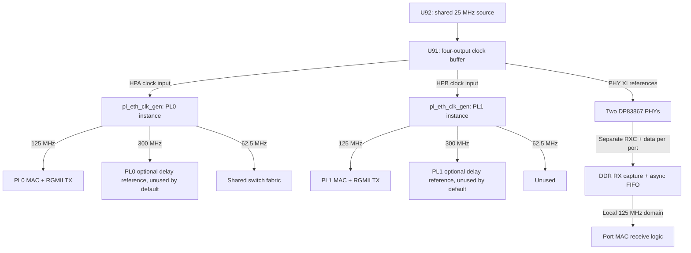

# KR260 board integration status

Inventory: 2026-09-19. The static board top, PL assembly and scripted PS block
design connect all six logical ports, DDR access and CPU DMA. Earlier local
Vivado reports show successful routing; bitstream generation was recorded
before a concurrent rebuild recreated the project directory. Complete I/O timing, CDC sign-off,
firmware and hardware bring-up remain pending. Portable switch simulations
stop at GMII, GEM FIFO, CPU AXI-S and decoded SFP interfaces.

## Reference material and revision scope

The local AMD XTP743 download contains
`038-05101-01_sck-kr_reva02_SKIT_20211015.pdf`, drawing 038-05101-01,
revision A02, dated 2021-10-15. Its SHA-256 is:

```text
3d9eab500bcacbe20bb98e0820988dcbcecd212cb4f11cb9b68934e4ae7305ad
```

The vendor PDF, archive, and vendor readme remain local under `docs/xtp743/`
and are excluded from Git. Obtain XTP743 through the
[AMD KR260 carrier schematic download](https://www.xilinx.com/member/forms/download/design-license.html?cid=bad0ada6-9a32-427e-a793-c68fed567427&filename=xtp743-kr260-schematic.zip).
These observations describe that drawing; confirm the fitted hardware revision
before applying them to a board.

The installed Vivado 2026.1 board models are under
`data/xhub/boards/XilinxBoardStore/boards/Xilinx/`: carrier
`kr260_carrier/2.0/board.xml` and SOM `kr260_som/2.0/part0_pins.xml`.
They supply interface names and connector-to-package mappings. Their component
metadata is not sufficient to identify the fitted PHY or oscillator topology.

## Schematic findings

| Sheet | Finding | Consequence for this design |
| --- | --- | --- |
| 20–21 | Both PL Ethernet PHYs are TI DP83867CSRGZ. The installed carrier board XML instead names a Marvell part. | Use the TI PHY register definitions for MDIO setup and delay configuration. |
| 16 | U92 supplies 25 MHz to U91, an NB3V1104 1:4 buffer. Outputs feed `HPA_CLK0P_CLK`, `HPB_CLK0P_CLK`, `GEM2_XTAL_IN`, and `GEM3_XTAL_IN`. | The two PL reference inputs share one oscillator in this drawing. They are not two independent oscillator sources. |
| 16 | FPGA nets `HPA05_CCN` and `HPB05_CCN` enter U19 (SLG7XL45106), which outputs the two PL PHY resets. | The XDC's `phy_reset_n` ports are reset requests into the sequencer. Establish its actual reset behavior during bring-up. |
| 16 | U90 supplies a 156.25 MHz differential reference on `GTH_REFCLK0_C2M_P/N` for SFP+. | The GTH IP now selects 156.25 MHz. Its 1.25 Gb/s line rate and 16-bit user width remain unchanged. The nearby U87 125 MHz source feeds PS GTR, not SFP GTH. |
| 14 / 7 | SFP TD_P/N and RD_P/N use `GTH_DP2_M2C_P/N` and `GTH_DP2_C2M_P/N`. The SOM map gives TX R4/R3, RX T2/T1 and reference Y6/Y5 (P/N). | The IP now selects X0Y6 for channel and TX/RX masters. The wrapper header reports a Vivado site check resolving the serial pins to GTHE4_CHANNEL_X0Y6 and reference pins to GTHE4_COMMON_X0Y1. This inventory checked the XCI and SOM pin map; vendor-tool validation was not rerun. |

## PL pin and clock plan

[`kr260_pl_ethernet.xdc`](../constraints/kr260_pl_ethernet.xdc) provides the
following mapping, plus the RGMII data/control, MDIO/MDC, and reset-request pins:

| Project port | Board interface | Bank | 25 MHz reference pin | RGMII RX clock pin |
| --- | --- | --- | --- | --- |
| PL0 / switch port 2 | PL GEM2 / HPA | 66 | C3 | D4 |
| PL1 / switch port 3 | PL GEM3 / HPB | 65 | L3 | K4 |

The board assembly uses two instances of
[`pl_eth_clk_gen`](../rtl/pl_gmii/pl_eth_clk_gen.sv). Each wraps the same
[`Clocking Wizard configuration`](../rtl/pl_gmii/ip/pl_eth_clk_gen_ip.xci).
Its configured ratios are input divide 1, feedback multiply 60, and output
divides 12, 5, and 24: a nominal 1500 MHz VCO yields 125, 300, and 62.5 MHz.
This describes the checked-in configuration, not measured hardware clocks.



Each output has reset release synchronized to its own clock after MMCM lock.
PL0's 62.5 MHz clock/reset drives the switch fabric, switch DDR masters,
CPU AXI DMA, both DDR SmartConnects and PS HP interface clocks. PL1's
62.5 MHz output is unused. The 300 MHz outputs are unused by the default
RGMII adapters because RX clock delay in the FPGA is disabled.

| Clock | Source | Consumers |
| --- | --- | --- |
| 125 MHz per PL port | Each PL MMCM, from its 25 MHz input | MAC and RGMII TX; local RX FIFO read side |
| PHY RXC per PL port | Each external PHY | RGMII DDR receive and FIFO write side |
| 62.5 MHz fabric | PL0 MMCM | Switch, DDR masters/interconnects, CPU DMA and HP0/HP1 clocks |
| About 142.857 MHz | PS PL0 output, requested as 150 MHz | MAC/MDIO AXI-Lite, HPM0_LPD and control interconnect |
| 50 MHz | PS PL1 output | GTH reset/calibration free-running clock |
| GEM0/1 RX and TX FIFO clocks | Four separate buffered PS outputs | Corresponding bridge RX/TX halves; per-domain `rst_sync` |
| SFP 125 / 62.5 MHz | SFP MMCM from GTH 62.5 MHz TXUSRCLK2 | Codec/MAC and PCS gearbox respectively |

[`sfp_pcs_clk_gen`](../rtl/sfp_pcs/sfp_pcs_clk_gen.sv) wraps a
[third IP configuration](../rtl/sfp_pcs/ip/sfp_pcs_clk_gen_ip.xci).
Its VCO is 1187.5 MHz (62.5 x 19), with output divisors 9.5 and 19.
The two PCS clocks retain synchronous timing checks; their relationship to
the GT user interfaces, receive clock correction and reset behavior still
need independent review and hardware validation.

Sharing an oscillator does not eliminate the receive clock-domain crossings.
Each PHY supplies its own RXC; the adapter captures RX data there and transfers
it through a FIFO to its local GMII clock. The two MMCM output sets also need
an explicit timing relationship or safe crossings; identical nominal frequency
alone is insufficient.

## MDIO management interface

[`mdio_controller`](../rtl/mdio/mdio_controller.sv) provides a Clause 22
master with a 32-bit AXI-Lite slave and a physical IOBUF. Its separate
[`portable model`](../rtl/mdio/mdio_controller_sim_model.sv) replaces only
the pin stage with tristate logic. The board assembly uses one controller per
PL MDIO bus; the source records PHY addresses 2 and 3 for PL0 and PL1.
Both controllers are instantiated in `kr260_pl_top`, with registers mapped
through `sc_ctl`; a FreeRTOS driver remains pending.

| Offset | Register | Current behavior |
| --- | --- | --- |
| `0x00` | CONFIG | PHY address `[4:0]`, PHY register `[12:8]`, write/read direction `[16]` (1 = write) |
| `0x04` | WRITE_DATA | Staged 16-bit data, byte-strobe writable |
| `0x08` | READ_DATA | Live master read shift register; use after completion |
| `0x0C` | CONTROL | Bit 0 starts a transaction; requests while busy are ignored |
| `0x10` | STATUS | Bit 0 BUSY, bit 1 sticky DONE, bit 2 sticky ERROR; bits 1–2 are write-one-to-clear |
| `0x14` | CLK_DIVIDER | 16-bit divider, reset value 100; MDC toggles every divider + 1 input clocks while busy |

At the observed 142.857 MHz register clock, divider 100 gives approximately
707.2 kHz MDC (742.6 kHz at the requested 150 MHz).
Clear old status, configure the transaction, issue START, wait for completion,
and inspect ERROR before consuming data. The master clears READ_DATA on every
START, including writes; it is not a separately retained last-successful-read
register. Keep the divider stable while a transaction is running. There is no
interrupt output or native Clause 45 transaction engine. PHY setup and extended
register access through Clause 22 procedures remain software work.

## SFP negotiation and transceiver integration

The SFP PCS now includes `autoneg_1000base_x` and exports informational
link/duplex/pause/fault status through the switch. Its three timer parameters
default to 8 cycles and are not exposed through the enclosing SFP/switch tops.
There is no TX backpressure or frame-boundary coordination while configuration
ordered sets override MAC data. Hardware timers, compatibility/fault rules,
idle detection, and link-down admission policy must be completed before use
with a real peer. See [known RTL gaps](inventory.md#known-gaps-in-existing-rtl).

The GTH wrapper is connected to the SFP pins and PCS clock generator in
`kr260_pl_top`. [`kr260_sfp.xdc`](../constraints/kr260_sfp.xdc) adds serial,
reference, sideband and LED pins. TX_DISABLE is tied low; `sfp_led[1:0]`
is `{sync_ok, an_link_up}`. LOS, MOD_ABS and TX_FAULT inputs are exposed but
unused by the control logic. Duplex/pause/fault status is not CPU-readable,
and module I2C is not connected. The existence of these pins and a bitstream
does not establish a usable optical link.

## Board build and implementation results

The checked-in build inputs are:

- [`build_kr260.tcl`](../build/build_kr260.tcl): creates the project, imports
  three XCI configurations, builds the PS block design and runs the requested
  `bd`, `synth` (default), or `impl` stage.
- [`impl_kr260.tcl`](../build/impl_kr260.tcl): opens the existing synthesized
  project, resets/re-runs implementation through bitstream and writes reports.
- [`synth_switch_top.tcl`](../build/synth_switch_top.tcl) and
  [`switch_top_files.f`](../build/switch_top_files.f): out-of-context digital
  switch synthesis; the file list matches `SWITCH_TOP_SRCS` in the Makefile.

The flow targets `xck26-sfvc784-2LV-c` and requires the installed
`xilinx.com:kr260_som:part0:2.0` board preset and vendor IP. The observed tool
version is Vivado 2026.1. From the repository root:

```bash
source /tools/Xilinx/2026.1/Vivado/settings64.sh
vivado -mode batch -source build/build_kr260.tcl -nolog -nojournal -tclargs synth
vivado -mode batch -source build/impl_kr260.tcl -nolog -nojournal
```

`build_kr260.tcl` deletes and recreates `build/vivado_kr260/` on each call,
including with `bd`; preserve any wanted prior results first. `impl_kr260.tcl`
restarts the existing implementation run. The scripts do not explicitly
validate run status after every `wait_on_run`, so inspect run status, logs,
reports and the bitstream rather than relying only on the batch exit code.
The bitstream path is
`build/vivado_kr260/kr260_switch.runs/impl_1/kr260_top.bit`.
Reports and generated IP/project products are ignored by Git. There is no
XSA export, FreeRTOS application or boot-image packaging flow yet.

The static [`kr260_top`](../rtl/board/kr260_top.sv) joins generated
`system_wrapper` ports to [`kr260_pl_top`](../rtl/board/kr260_pl_top.sv).
The block design contains the PS, AXI DMA, reset block, interrupt concatenator
and **three SmartConnects**:

| Interconnect | Connection |
| --- | --- |
| `sc_ctl` | PS HPM0_LPD to three MACs, two MDIO controllers and DMA control; two clock domains |
| `sc_ddr` | Physical ingress write, physical egress read and combined CPU pool read/write AXI interfaces to HP0 |
| `sc_dma` | CPU AXI DMA SG, MM2S and S2MM masters to HP1 |

CPU AXI DMA uses scatter-gather, 16-bit streams, 32-bit data memory masters,
DRE on both channels and 16-beat bursts. It copies between software buffers
and the CPU switch port; the switch's dedicated CPU DMA engines separately
copy between that stream and the shared switch pool.

Local reports dated 2026-09-19 show setup WNS **+0.726 ns**, hold WHS
**+0.010 ns**, 25,527 LUTs (21.80%), 39,696 registers (16.95%), 49.5 BRAM tiles
and 3 of 4 MMCMs. An earlier bitstream was recorded before a concurrent build recreated the
project directory. These earlier reports
were inspected, not regenerated during this inventory; source-to-artifact
identity was not established by a clean rebuild. Missing external I/O delays
and unresolved CDC prevent calling this complete timing closure. Exact report
findings and fingerprints are in [verification](verification.md#local-vivado-implementation-evidence).

PS configuration set by the script: GEM0 = SGMII on PS-GTR lane 0 (125 MHz
reference from U87 -- marked `VALUE/DNP TBD` on the schematic, so confirm it is
fitted), GEM1 = RGMII on MIO38-49 with MDIO on MIO50-51, both in external-FIFO
mode; the SOM preset does not configure them. PL0 is requested at 150 MHz but
the PS produces about 142.857 MHz; the AXI-Lite/MAC domain runs there.

| Block | Base address | Size |
| --- | --- | --- |
| CPU AXI DMA | `0x80000000` | 64 KiB |
| MDIO0 (PL0 PHY) / MDIO1 (PL1 PHY) | `0x80010000` / `0x80020000` | 64 KiB each |
| PL0 MAC / PL1 MAC / SFP MAC | `0x80040000` / `0x80080000` / `0x800C0000` | 256 KiB each |

The local address report maps each CPU DMA master to DDR `0x00000000`–
`0x7FFFFFFF` and also exposes the PS QSPI aperture. The switch pool
`0x10000000`–`0x1007FFFF` must be reserved separately from software buffers and
descriptor rings. The script relies on automatic mapping for memory windows;
review generated address segments and software cache/ownership rules before use.

PS `pl_ps_irq0[7:0]` receives, in bit order: PL0 `interrupt`, PL0 `mac_irq`,
PL1 `interrupt`, PL1 `mac_irq`, SFP `interrupt`, SFP `mac_irq`, DMA MM2S,
and DMA S2MM. Firmware still needs interrupt routing and service routines.

Findings from the implementation flow (none visible in simulation or in
isolated synthesis):

- **RGMII RX clock delay was illegal.** `IDELAYE3` cannot drive a BUFG, so the
  IBUF-IDELAYE3-BUFG scheme could not be placed, and it also left two
  unconstrained `IDELAYCTRL`s. `RX_IDELAY_ENABLE` now defaults off; the DP83867
  must add the RX/TX delay (RGMII-ID) through strap or MDIO.
- **GEM clocks.** The PS gives separate RX and TX FIFO clocks; a single-clock
  bridge put PS RX signals in the wrong domain (CDC report: 1296 endpoints from
  the GEM RX clock to the GEM TX clock). `ps_gem_axis_bridge` and `switch_top`
  now take both clocks.
- **Clock crossings.** [`kr260_clocks.xdc`](../constraints/kr260_clocks.xdc)
  applies 7/8/16 ns `set_max_delay -datapath_only` bounds between selected
  whole clock domains. Same-MMCM synchronous pairs retain their normal
  timing checks. These bounds limit path delay; they do not add synchronizers
  or independently establish bus-skew safety. Their scope and hard-coded
  generated-clock names need review whenever the clock topology changes.
- **CDC is not signed off.** The summary has 10 critical clock-pair groups;
  the detailed report contains 2,939 critical findings. Some involve FIFO
  storage and need structural review; others include the former unsynchronized
  FIFO-empty-to-GEM-overflow-clear crossing. The latest RX changes remove that
  dependency; a fresh routed report is still needed for the updated source. `ASYNC_REG` attributes on pointer,
  tick and reset synchronizers do not resolve all CDC paths. Do not dismiss
  the report as merely an unrecognized FIFO implementation.

Still unverified or absent: RGMII input/output delay constraints; PHY
initialization; SFP module I2C (`HDB16/HDB17`, pins AB11/AC11, not connected);
the MMCM-to-GT clock phase (static timing only); the SFP LED and sideband
behavior; and every hardware behavior.

## Remaining implementation and verification

- Configure the PHYs over MDIO (DP83867 RX/TX internal delay for RGMII-ID, and
  the other setup) from firmware; there is no driver for the MDIO register map.
- Add RGMII input/output delay constraints and verify RX/TX timing on hardware.
- Replace the continuous RX FIFO transfer assumption with a verified policy
  for clock drift, packet boundaries, overflow and underflow. The current
  16-entry FIFO ignores full status and emits an idle when empty.
- Resolve the CDC findings, repair unsynchronized control paths, and review
  FIFO storage/pointer constraints and resets. Record justified waivers only
  after checking the actual structure and protocol.
- Connect the SFP module I2C, and confirm the SFP sideband, LEDs and the fitted
  U87 reference on GTR_REFCLK0.
- Check the MMCM-to-GT clock phase on the SFP PCS path beyond static timing.
- Everything on hardware: bring-up, link, DMA, throughput.

The RGMII and PL clock behavioral models do not establish these hardware properties:
the RGMII model omits the real CDC FIFO and I/O delay primitives; the clock
model ignores its input reference and free-runs clocks at nominal periods.
