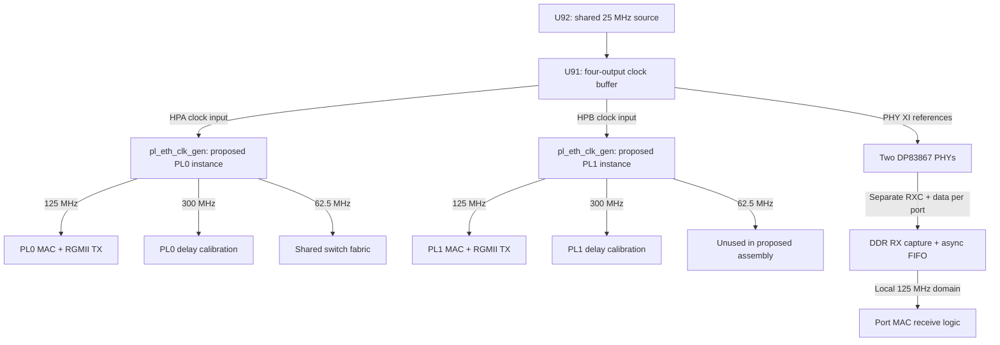

# KR260 board integration status

Inventory: 2026-09-18. RGMII adapter, clock-generator, and PL pin-constraint
sources exist. A board wrapper joining them to `switch_top` does not yet exist.
The existing switch simulations stop at GMII, GEM FIFO, CPU AXI-S, and decoded
SFP parallel interfaces.

## Reference material and revision scope

The local AMD XTP743 download contains
`038-05101-01_sck-kr_reva02_SKIT_20211015.pdf`, drawing 038-05101-01,
revision A02, dated 2021-10-15. Its SHA-256 is:

```text
3d9eab500bcacbe20bb98e0820988dcbcecd212cb4f11cb9b68934e4ae7305ad
```

The vendor PDF, archive, and vendor readme remain local under `docs/xtp743/`
and are excluded from Git. Obtain XTP743 through the
[AMD KR260 carrier schematic download](https://www.xilinx.com/member/forms/download/design-license.html?cid=bad0ada6-9a32-427e-a793-c68fed567427&filename=xtp743-kr260-schematic.zip).
These observations describe that drawing; confirm the fitted hardware revision
before applying them to a board.

The installed Vivado 2026.1 board models are under
`data/xhub/boards/XilinxBoardStore/boards/Xilinx/`: carrier
`kr260_carrier/2.0/board.xml` and SOM `kr260_som/2.0/part0_pins.xml`.
They supply interface names and connector-to-package mappings. Their component
metadata is not sufficient to identify the fitted PHY or oscillator topology.

## Schematic findings

| Sheet | Finding | Consequence for this design |
| --- | --- | --- |
| 20–21 | Both PL Ethernet PHYs are TI DP83867CSRGZ. The installed carrier board XML instead names a Marvell part. | Use the TI PHY register definitions for MDIO setup and delay configuration. |
| 16 | U92 supplies 25 MHz to U91, an NB3V1104 1:4 buffer. Outputs feed `HPA_CLK0P_CLK`, `HPB_CLK0P_CLK`, `GEM2_XTAL_IN`, and `GEM3_XTAL_IN`. | The two PL reference inputs share one oscillator in this drawing. They are not two independent oscillator sources. |
| 16 | FPGA nets `HPA05_CCN` and `HPB05_CCN` enter U19 (SLG7XL45106), which outputs the two PL PHY resets. | The XDC's `phy_reset_n` ports are reset requests into the sequencer. Establish its actual reset behavior during bring-up. |
| 16 | U90 supplies a 156.25 MHz differential reference on `GTH_REFCLK0_C2M_P/N` for SFP+. | The GTH IP's current 125 MHz reference setting must be reconciled and regenerated before hardware use. The 1G line-rate target does not itself require a 125 MHz reference. |

## PL pin and clock plan

[`kr260_pl_ethernet.xdc`](../constraints/kr260_pl_ethernet.xdc) provides the
following mapping, plus the RGMII data/control, MDIO/MDC, and reset-request pins:

| Project port | Board interface | Bank | 25 MHz reference pin | RGMII RX clock pin |
| --- | --- | --- | --- | --- |
| PL0 / switch port 2 | PL GEM2 / HPA | 66 | C3 | D4 |
| PL1 / switch port 3 | PL GEM3 / HPB | 65 | L3 | K4 |

The proposed assembly uses two instances of
[`pl_eth_clk_gen`](../rtl/pl_gmii/pl_eth_clk_gen.sv). Each wraps the same
[`Clocking Wizard configuration`](../rtl/pl_gmii/ip/pl_eth_clk_gen_ip.xci).
Its configured ratios are input divide 1, feedback multiply 60, and output
divides 12, 5, and 24: a nominal 1500 MHz VCO yields 125, 300, and 62.5 MHz.
This describes the checked-in configuration, not measured hardware clocks.



Each output has reset release synchronized to its own clock after MMCM lock.
Only PL0's 62.5 MHz clock/reset is intended to drive the shared switch fabric;
this choice is documented in the wrapper header but has not been wired into a
board top. The 150 MHz MAC AXI clock and PS/GEM clock/reset integration also
remain external. The SFP 125/62.5 MHz gearbox relationship needs its own
transceiver-compatible clock plan.

Sharing an oscillator does not eliminate the receive clock-domain crossings.
Each PHY supplies its own RXC; the adapter captures RX data there and transfers
it through a FIFO to its local GMII clock. The two MMCM output sets also need
an explicit timing relationship or safe crossings; identical nominal frequency
alone is insufficient.

## Remaining implementation and verification

- Connect the hardware adapters and clock generators to the MACs in a board
  wrapper with port names matching the XDC; add PS/DDR and management wiring.
- Implement MDIO/MDC and PHY initialization, including explicit RX/TX delay
  settings. TX currently forwards an unshifted clock and RX defaults to 700 ps
  FPGA delay; neither is a validated board timing solution.
- Define reset pulse widths and calibration readiness. The RGMII adapter
  currently leaves `IDELAYCTRL.RDY` unused.
- Replace the continuous RX FIFO transfer assumption with a verified policy
  for clock drift, packet boundaries, overflow and underflow. The current
  16-entry FIFO ignores full status and emits an idle when empty.
- Add external input/output delay constraints, generated-clock/CDC constraints,
  implementation timing reports, and hardware tests. The existing XDC contains
  package pins, I/O standards and primary clock declarations only.
- Check in reproducible IP-generation, isolated synthesis and board-build
  scripts. Existing source comments report isolated Vivado checks; this
  inventory reran the portable model tests, not those vendor-tool checks.

The two new behavioral models do not establish these hardware properties:
the RGMII model omits the real CDC FIFO and I/O delay primitives; the clock
model ignores its input reference and free-runs clocks at nominal periods.
