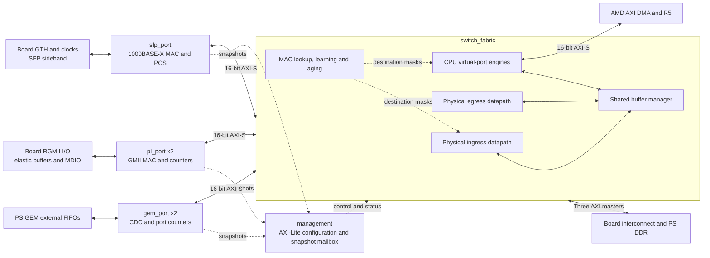

# IP repository partitioning

## Implemented boundaries

The first structural migration separates forwarding/storage from all five
physical port endpoints. No packet pipeline stage, FIFO depth, clock,
reset sequence, register address, counter index or firmware ABI is changed.

`ip_repo/switch_fabric/hdl/switch_fabric.sv` owns the shared buffer manager,
physical ingress/egress, CPU virtual port and forwarding table. The buffer
manager is a sibling of `ingress_datapath`, rather than a child of ingress.
`rtl/dma/ingress_top.sv` remains a compatibility assembly for existing
ingress subsystem tests and instantiates the same ingress datapath.

`ip_repo/gem_port/hdl/switch_gem_port.sv` combines the existing GEM bridge
with its RX and TX counter banks. `rtl/switch_top.sv` is now a wiring
assembly of the fabric and five endpoints, plus the unchanged statistics
bank decoder. It preserves the existing board and testbench port list.

The other three IP manifests package the existing PL MAC, SFP MAC/PCS and
management modules. `scripts/ip_sources.py` deduplicates shared leaf RTL
and orders packages before modules. Simulation, out-of-context switch
synthesis and the board build use this resolver, replacing the board's
recursive source glob. `build/switch_top_files.f` is a compatibility list;
the manifests are authoritative.

## Interface contracts

| Boundary | Contract |
| --- | --- |
| Physical fabric ingress | `s00_axis` through `s04_axis`; 16-bit data, two byte enables, valid/ready/last, bad-frame `TUSER`; fabric clock |
| Physical fabric egress | `m00_axis` through `m04_axis`; 16-bit data, two byte enables, valid/ready/last; fabric clock |
| CPU streams | Existing 16-bit `cpu_s_axis`/`cpu_m_axis`, fabric clock |
| DDR | Existing 32-bit addresses, 128-bit data, physical write master, physical read master, bidirectional CPU master |
| Port numbering | GEM0=0, GEM1=1, PL0=2, PL1=3, SFP=4, CPU=5 |
| Statistics | Existing four-phase request/ack handshake; select remains stable through completion; held snapshot data and clear-on-read behavior unchanged |
| Counter ownership | GEM banks 0–3 inside GEM endpoints; PL/SFP banks 4–6 inside MAC endpoints; CPU/DDR/debug banks 7–12 inside fabric |
| Resets and CDC | Physical endpoint CDC remains local; fabric runs at 100 MHz; management and MAC control use the existing PS control clock |
| Parameters | Fabric exposes only `STATS_DDR`, `STATS_DEBUG`, and `AGE_TICK_DIVIDE_COUNT`; imported package geometry is not a GUI parameter |

The adapters retain their existing frame/FCS conventions and backpressure
rules. This migration does not add PL 10/100 operation or faster SFP rates.
The CPU override and RX-tag paths retain the baseline behavior, including
the previously documented unresolved concurrency/CDC concerns.

## Verification

The reference is Git commit `6b180e0138d5592cfb80078a9a2517d63013927b`.
`scripts/check_ip_equivalence.py` retrieves its original switch and ingress
assemblies and compares them with the partitioned design under identical
inputs and DDR responses. Every external output is compared after every
relevant clock edge, including statistics data/acknowledgments. It also
runs the existing packet-content and control regression assertions.

All four combinations of `STATS_DDR` and `STATS_DEBUG` passed:

| DDR/debug | Clock samples | Outputs per sample | Completed snapshot reads |
| --- | ---: | ---: | ---: |
| 0/0 | 29,922 | 114 | 1,591 |
| 1/0 | 29,922 | 114 | 1,366 |
| 0/1 | 29,922 | 114 | 1,543 |
| 1/1 | 29,922 | 114 | 1,326 |

The stimulus covers GEM0-to-CPU forwarding, byte contents, link flushing,
blocked data traffic, reserved control-frame delivery, CPU destination
override and return to normal forwarding. Snapshot traffic spans all bank
and slot values, including unmapped banks. This is a finite simulation
comparison, not formal equivalence or an all-port stress proof.

The module regression passed buffer-manager, ingress, egress, GEM bridge,
egress/GEM integration, PL adapters, SFP port, CPU port, forwarding,
statistics, multirate GEM, ingress pipeline and diagnostics tests.

Packaging checks compare staged source contents with the manifests and
assert interface widths, unique clock associations, resets and the legal
fabric parameter list. Generated IP wrappers are additionally exercised
through the same comparison fixture; Vivado integrity checking alone did
not detect its initial erroneous promotion of package constants into
module parameters. The packaging script explicitly corrects this.

Local evidence is under `build/ip_refactor/`. The isolated board project
is `build/vivado_kr260_modular/`; its implementation result is recorded in
[verification](verification.md).

## Remaining migration and acceptance work

The reusable **digital** IP boundaries are implemented. The complete
physical-port/block-design migration proposed for the final architecture
is not complete:

1. Move each RGMII I/O/elastic-buffer/MDIO shell inside its copper-port IP,
   with scoped constraints and explicit per-instance IDELAY groups. The
   current board constraints name `u_pl/u_rgmii0` and `u_pl/u_rgmii1`, so
   this requires a separate physical timing check.
2. Move the GTH, PCS clock generator and SFP sideband shell into the SFP
   package, with reproducible vendor-IP dependencies and scoped clocks.
3. Move the statistics bank decoder into the management assembly and
   instantiate the packaged endpoints/fabric in the production block
   design. The generated `partition_validation.bd` is currently an
   interface-validation design, not the production system.
4. Add a six-port concurrent packet scoreboard with randomized DDR
   backpressure/errors, exhaustion, link/reset transitions and ownership
   invariants. Existing subsystem tests and the finite comparison do not
   replace that coverage.
5. After routed timing/CDC review, repeat board DHCP, ping, forwarding,
   GEM1 speed, SNMP/web and SD configuration regression. Do not attribute
   existing STP or transient outage problems to this structural migration
   without new evidence.

The partitioned all-counter image has subsequently been loaded over JTAG.
DHCP, CPU connectivity, web/SNMP access and settled endpoint forwarding
passed on the connected GEM1/PL0 path. Initial DHCP/endpoint losses were
observed before recovery; see [hardware results](verification.md). The
remaining all-port and speed-matrix acceptance work still applies.
