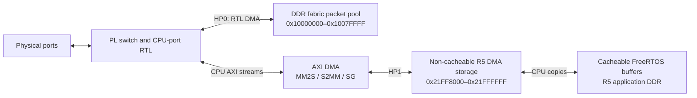

# Memory map, usage and ownership

Updated 2026-09-23 for the R5-0 split-mode FreeRTOS firmware with data cache
enabled and the normal FPGA image without ILAs.

This document describes the application's memory contract and the register
windows it uses. It is not a complete Zynq UltraScale+ address map. R5-1 is
held in reset; the A53 runs the FSBL during JTAG initialization and is then
left stopped. Any future A53 OS, second R5 application or boot payload must
honor the reservations below.

Addresses are hexadecimal; range endpoints are inclusive unless explicitly
identified as end symbols. MiB/KiB mean powers of two.

## Reserved memory

| Address range | Size | Usage | Owner and access rules |
| --- | ---: | --- | --- |
| `0x00000000–0x0000FFFF` in the R5-0 local view | 64 KiB | ATCM vectors, boot code and boot data | R5-0 startup and exception handling. This is local TCM, not a DMA buffer address. |
| `0x10000000–0x1007FFFF` in DDR | 512 KiB | Switch packet pool: 256 slots × 2048 bytes | PL buffer manager owns allocation and lifetime. PL ingress/egress and CPU-port RTL DMA engines access payloads through HP0. R5 firmware does not directly access this pool. |
| `0x20000000–0x21DFFFFF` in DDR | 30 MiB | R5 code, constants, data, FreeRTOS heap, stacks and driver state | R5-0 application reservation. The unused portion is reserved capacity, not available to other software without changing this contract. |
| `0x21E00000–0x21EFFFFF` in DDR | 1 MiB | USB host heap, rings, contexts and DMA bounce buffer | R5 USB stack; separate non-cacheable, shareable, execute-never MPU region, single owner; PS USB0 DMA accesses it |
| `0x21F00000–0x21FF7FFF` in DDR | 992 KiB | Reserved gap | Not allocated by firmware |
| `0x21FF8000–0x21FFFFFF` in DDR | 32 KiB | CPU virtual-port AXI DMA descriptors and RX/TX bounce buffers | R5 DMA driver controls ownership transfers to/from AXI DMA. AXI DMA accesses this storage through HP1. |
| Other DDR addresses | Not assigned here | Outside the application's explicit reservations | Do not assume these are free: boot software, other processors and future operating systems require their own allocation review. |

The last two rows of allocated DDR form one contiguous 32 MiB R5 reservation,
`0x20000000–0x21FFFFFF`. The linker excludes the separate fabric packet pool.

R5 local address zero resolves to ATCM for this firmware. It must not be
interpreted as the same storage seen by a PL AXI master at address zero.
DMA pointers are identity-mapped DDR addresses; descriptors never point into
R5-local TCM.

The linker does not allocate R5 BTCM, other-core TCM or OCM for application
sections. Their absence from the linker does not establish that they are
unused by boot software or available for shared DMA storage.

## Cache and memory attributes

| Region | R5 policy |
| --- | --- |
| Application DDR | BSP normal, non-shareable, write-back/write-allocate mapping; D-cache enabled |
| DMA DDR reservation | Higher-priority MPU override: normal, shareable, non-cacheable, execute-never, full read/write access |
| PL register windows | BSP strongly ordered, non-cacheable mapping |
| PS peripheral registers used below | BSP device, non-cacheable mapping |
| Fabric packet pool | No dedicated R5 MPU override; falls within the general DDR mapping, but R5 does not access it |
| ATCM | Tightly coupled storage; not serviced as cached DDR |

Startup flushes/disables D-cache before installing the DMA override, checks
the actual MPU registers, then enables D-cache. The verified boot used MPU
region 10 with attributes `0x0000130C`; the region number is allocated by the
BSP and is not a fixed software interface.

The MPU policy controls R5 accesses. It does not restrict the addresses that
a PL DMA master can generate, and shareable memory does not make the R5 cache
hardware-coherent with DMA. Application-level reservation and ownership rules
remain necessary.

DMA descriptors and payloads are non-cacheable, so the current driver needs
ownership barriers but no per-packet cache clean/invalidate operations.
Cacheable FreeRTOS packet buffers are copied into/out of the DMA buffers;
their addresses are never handed directly to AXI DMA.

**Future work:** review descriptor and payload cache policies separately
after measuring CPU cost and throughput. Cached DMA storage would require
cache-line isolation, explicit maintenance at ownership transfers, and
ring-reuse/reset/error-recovery verification.

PSU JTAG reads see DDR and may miss dirty R5 cache contents. Reading a stale
`xTickCount` or software diagnostic variable through JTAG does not prove the
R5 has stopped. MMIO and the non-cacheable DMA region remain directly readable.

## R5 application allocations

Within cacheable DDR, the linker places executable code and constants,
initialized data, BSS, a C-library heap, and startup/exception stacks.

| Allocation | Current configured size | Usage and ownership |
| --- | ---: | --- |
| FreeRTOS `ucHeap` | 512 KiB | Static array in BSS used by `heap_4`; supplies dynamic RTOS allocations, task stacks and network buffers. Owned by the RTOS allocator and its clients. |
| Linker C-library heap | 16 KiB | Separate from `ucHeap`; reserved for C-library allocation support. |
| Main/startup stack | 16 KiB | R5 startup/application execution before or outside task stack use, as defined by the startup code. |
| IRQ, abort, FIQ and undefined-mode stacks | 1 KiB each | R5 exception-mode storage. |
| Supervisor-mode stack | 2 KiB | Supervisor-mode exception/startup storage. |

Task stacks are not separate fixed DDR address windows: FreeRTOS allocates
them from its heap. Exact code, data, heap and stack addresses change when
the firmware is linked. The authoritative current layout is
`software/r5/out/kr260_r5.map`; the reservation boundaries above are fixed
by the checked-in linker script.

## Non-cacheable DMA allocation

The driver has 16 RX descriptors, two TX descriptors, and one 1536-byte
bounce buffer per descriptor. Each descriptor occupies 64 bytes; all arrays
are 64-byte aligned. Total allocated storage is 28,800 bytes, leaving
3,968 bytes reserved within the MPU region.

This is the allocation in the cache-enabled ELF verified on 2026-09-21.
Individual array addresses can change with compiler/linker layout; software
uses symbols, not these literal addresses.

| Address range | Bytes | Object | Usage |
| --- | ---: | --- | --- |
| `0x21FF8000–0x21FF8BFF` | 3,072 | `tx_data[2][1536]` | CPU writes outgoing frames; DMA reads them |
| `0x21FF8C00–0x21FFEBFF` | 24,576 | `rx_data[16][1536]` | DMA writes received frames; CPU reads them after completion |
| `0x21FFEC00–0x21FFEC7F` | 128 | `tx[2]` | TX descriptor rotation |
| `0x21FFEC80–0x21FFF07F` | 1,024 | `rx[16]` | RX descriptor ring |
| `0x21FFF080–0x21FFFFFF` | 3,968 | Reserved slack | Not allocated to ordinary application data |

The section is `.dma_nocache (NOLOAD)`, outside startup BSS clearing.
After successfully resetting AXI DMA, `fabric_dma_init` explicitly clears
descriptors and buffers, initializes links/control fields, and publishes them
to DMA. This prevents stale contents from a prior boot becoming valid work.
ELF checks enforce array placement, alignment and separation from BSS/stacks.

## Packet ownership and data flow

The fabric pool and R5 DMA buffers are separate stores, connected by the
CPU port's AXI streams:

The CPU-port RTL reads/writes the fabric pool through HP0. The vendor AXI DMA
reads/writes R5 descriptors and bounce buffers through HP1. Neither the
FreeRTOS allocator nor the vendor AXI DMA owns fabric-pool allocation.
PS GEMs use external FIFO interfaces; their internal DMA engines do not
manage these DDR regions.

### Fabric packet pool

1. An ingress engine obtains a buffer ID from the PL free-list manager.
2. The payload is written at
   `0x10000000 + buffer_id × 2048`.
3. Queue metadata records frame length and destinations. A flooded frame
   shares one payload slot among its destination queues.
4. The slot remains allocated while destinations retain references.
   Completion or queue flush releases references; the free-list manager
   returns the slot when no references remain.

A CPU-originated frame also obtains a fabric-pool slot. A frame delivered
to the CPU is copied from the pool over AXI-stream into an R5 RX buffer.
These ownership transitions are distinct from the R5 DMA ring lifecycle.

### R5 transmit

1. R5 copies a cacheable network packet into an available TX bounce buffer
   and pads short frames.
2. It initializes the TX descriptor, executes the ownership barrier and
   writes AXI DMA's tail descriptor register.
3. DMA owns the submitted descriptor/buffer until completion. R5 polls
   completion but does not overwrite the submitted data.
4. After completion and error checks, the driver can reuse the storage.
   Two descriptors alternate so consecutive submissions have different
   tail addresses. This driver sends synchronously.

### R5 receive

1. R5 submits initialized RX descriptors/buffers to DMA.
2. DMA fills a buffer and writes completion/status.
3. R5 observes completion, executes the barrier, validates status/length,
   and copies the packet into software-owned storage. The network service
   then allocates/copies into the FreeRTOS network buffer.
4. R5 clears status and republishes the descriptor after a barrier.
   DMA can reuse the buffer only after that handoff.

A DMA error or TX timeout marks the driver failed. It does not reuse storage
that hardware might still own. Firmware disables ports; automatic DMA restart
remains future work.

## PL memory-mapped register windows

These are AXI-Lite register apertures, not packet RAM. Unimplemented offsets
inside an aperture are not allocatable memory.

| Address range | Size | Block | Control owner |
| --- | ---: | --- | --- |
| `0x80000000–0x8000FFFF` | 64 KiB | CPU-port AXI DMA | R5 DMA driver; MM2S at offset 0, S2MM at offset 0x30 |
| `0x80010000–0x8001FFFF` | 64 KiB | PL0 MDIO controller | PL sequencer initializes/polls PHY; R5 reads the completed status snapshot |
| `0x80020000–0x8002FFFF` | 64 KiB | PL1 MDIO controller | Same ownership model as PL0 |
| `0x80030000–0x8003FFFF` | 64 KiB | SFP AXI IIC | Current firmware leaves it unused; diagnostic tools access module EEPROM/PHY |
| `0x80040000–0x8007FFFF` | 256 KiB | PL0 MAC registers | R5 initializes MAC; hardware updates counters/status |
| `0x80080000–0x800BFFFF` | 256 KiB | PL1 MAC registers | Same as PL0 |
| `0x800C0000–0x800FFFFF` | 256 KiB | SFP MAC registers | R5 initializes MAC; hardware updates counters/status |
| `0x80100000–0x8010FFFF` | 64 KiB | Fabric diagnostics and link control | R5 link task controls port admission/flush; PL supplies status/events; also per-port forward/learn enable, a CPU TX destination override, and a CPU RX ingress-port tag for control-protocol hooks, owned by `software/r5/src/pstate.c`/`fabric_dma.c`; `stp_task.c` is the current consumer running real STP |

Statistics extend this aperture at offsets `0x24–0x34`; the R5 statistics
task exclusively owns read/clear DATA. Accumulated totals and sensor snapshots
are normal cacheable R5 BSS, with no new fixed DDR reservation. See
[statistics.md](statistics.md) for the protocol and software access rules.

Diagnostic offsets include LINK_SET `+0x0C`, LINK_CLR `+0x10`,
LINK_STATUS `+0x14`, and PCS_STATUS `+0x20`. Control-protocol hooks add
FWD_SET `+0x38`, FWD_CLR `+0x3C`, LEARN_SET `+0x40`, LEARN_CLR `+0x44`,
PORT_CTRL_STATUS `+0x48` (read: `{18'd0, learn_en[5:0], fwd_en[5:0]}`),
CPU_TX_OVERRIDE `+0x4C` (write: bit31=go, bits5:0=destination port mask;
bit31 always reads 0, bits5:0 echo the last-written mask), and
CPU_RX_TAG `+0x50` (read-only: bit31=valid, bits2:0=the physical ingress
port of the CPU's next unread RX DMA descriptor; each read pops one entry,
owned by `software/r5/src/fabric_dma.c`/`stp_task.c`). Both enables
default all-ports-enabled out of reset. See
[rx_diag_regs.sv](../rtl/board/rx_diag_regs.sv) and
[architecture: control-protocol hooks](architecture.md#control-protocol-hooks-stplacplldp-no-protocol-logic)
for the full register contract.
Diagnostic accesses must respect software ownership: concurrent IIC or MDIO
users require arbitration; some counters/status registers have read side effects.

## PS registers used by this firmware

This table lists bases or individual registers, not entire reserved RAM regions.

| Address | Resource | Usage / owner |
| --- | --- | --- |
| `0xFF030000` | PS I2C1 base | R5 sensor task; INA260 SOM power monitor at I2C address `0x40` |
| `0xFFA50000` | AMS / PS and PL SYSMON | R5 sensor task; temperature and voltage sequencing/readout |
| `0xFF010000` | UART1 base | R5 console, connected to the board UART bridge |
| `0xFF0B0000` | GEM0 base | R5 configures PS MAC and external FIFO operation |
| `0xFF0C0000` | GEM1 base | R5 configures MAC; shared MDIO bus serves both PS PHYs |
| `0xFF110000` | TTC0 base | R5 FreeRTOS tick source |
| `0xFF120000` | TTC1 base | R5 free-running timestamp source |
| `0xFF180308` | GEM clock-control register | R5 selects the FIFO clocks routed through PL |
| `0xF9000000` | GIC distributor base | R5 interrupt initialization |
| `0xF9001000` | RPU GIC CPU interface base | R5 FreeRTOS interrupt handling |

The JTAG boot script also accesses reset, boot-mode and RPU configuration
registers. Those belong to the boot sequence, not the runtime packet-memory
allocator.

## Internal FPGA memories and access limits

Frame staging RAMs, async FIFOs, MAC packet buffers, MAC-table banks,
queue links, lengths and reference counts are internal FPGA memories.
They do not have general-purpose CPU-visible DDR addresses. Their owners
are the corresponding RTL engines; AXI-Lite exposes only implemented
control/status interfaces.

The generated AXI DMA address map permits access to a much broader low-DDR
window (`0x00000000–0x7FFFFFFF`) and also includes a QSPI aperture.
That routing reachability is not an allocation or permission to use those
addresses. Current descriptors target only the reserved R5 DMA region.
The linker and driver enforce software allocation rules; this design has
not established hardware isolation against an invalid DMA address.

## Authoritative sources and change rules

- [R5 linker script](../software/r5/linker.ld): ATCM and DDR reservations.
- [R5 startup/cache configuration](../software/r5/src/board.c): MPU override and peripheral initialization.
- [R5 DMA driver](../software/r5/src/fabric_dma.c): descriptor sizes, rings and ownership barriers.
- [FreeRTOS configuration](../software/r5/include/FreeRTOSConfig.h): RTOS heap size.
- [Buffer manager parameters](../rtl/buf_mgr/buf_mgr_pkg.sv) and
  [RTL DMA parameters](../rtl/dma/axi_dma_pkg.sv): fabric pool geometry/base.
- [Board build script](../build/build_kr260.tcl): register apertures and HP0/HP1 wiring.
- Generated local evidence: `build/reports/address_map.txt`,
  `software/r5/out/kr260_r5.map`, and `software/r5/out/kr260_r5.elf`.

Changes to buffer counts, frame sizes, DDR reservations or other processor
software must preserve non-overlap, update the linker/MPU/driver together,
and rerun the ELF audit and DMA ownership tests. Do not enlarge the fabric
pool or enable another processor without reviewing all reservations.

## USB storage and persistent configuration (2026-09-23)

R5 startup initializes USB0 xHCI at `0xFE200000` (DWC3 globals at `0xFE20C100`).
It uses PS I2C1 at `0xFF030000` to release the carrier USB0 PHY/hub/card-reader
resets and attach the hub before the sensor task takes ownership of I2C1.
USB1 remains outside this storage implementation. The HTTP task subsequently
owns storage access; network and STP settings reads only copy the RAM snapshot.

The linker reserves `.usb_nocache` at `0x21E00000–0x21EFFFFF` for USB allocations.
A separate MPU override uses normal, shareable, non-cacheable, execute-never
attributes. Aligned allocations, transfer rings, device contexts, scratchpads
and a 64 KiB bounce buffer belong to this pool. Cached stack/filesystem buffers
are bounced by xHCI. Event consumption uses an acquire barrier; queue publication
uses the upstream write barriers. The allocator initializes on first use and
coalesces freed allocations. Ethernet's existing 32 KiB DMA region is unchanged.

Configuration is stored in two root files on an existing FAT microSD volume;
there is no configuration QSPI reservation. See [configuration](configuration.md)
and [USB storage](usb-storage.md). The USB allocation is linker-verified; board enumeration and configuration
save/readback across reset passed with both DMA MPU overrides active on
2026-09-24. Hotplug and physical power-cycle tests remain pending.
