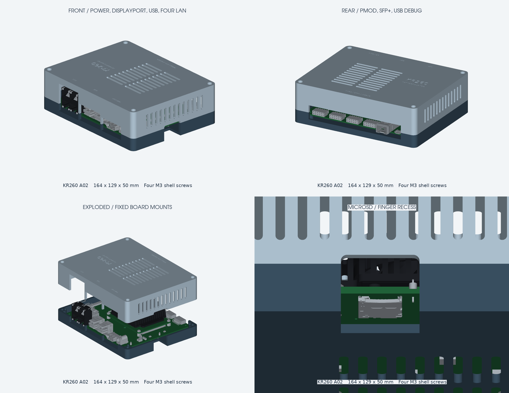

# KR260 A02 screw-fastened clamshell — revision 2

This revision is built around the **supplied carrier STEP assembly**, including
its connectors, SOM, heatsink and fan. It replaces the previous adjustable-rail
prototype with four fixed PCB mounting posts, mostly closed side walls, measured
connector openings and a microSD finger recess.



## Print files

| File | Use |
| --- | --- |
| [base.stl](output/base.stl) | Lower shell with four integral PCB mounting posts; print 1 |
| [lid.stl](output/lid.stl) | Upper shell, already rotated roof-down for printing; print 1 |
| [fit_frame.stl](output/fit_frame.stl) | Optional reduced-material check of the exact four mounting positions |
| [fit_coupon.stl](output/fit_coupon.stl) | Insert and screw-hole sizing sample; print first |
| [clamshell.step](output/clamshell.step) | Both shells in assembled coordinates, without vendor board geometry |
| [reference_measurements.json](output/reference_measurements.json) | Extracted source dimensions and interface bounds |
| [validation.json](output/validation.json) | Geometry, reference collision and exported mesh checks |
| [kr260-enclosure.zip](kr260-enclosure.zip) | Current print files, STEP, preview, source and this guide |

Only **two printed parts** are needed for the finished enclosure. There are no
sliding rails, loose spacers or hinge. The shells lift apart after removing four
screws. The old prototype is preserved in `archive/` and is not in the current ZIP.

## Geometry and connector access

* Body: **164 × 129 × 50 mm**, excluding feet and the projecting SFP cage.
* Walls, floor and roof: 3 mm; shell seam: z=16 mm.
* PCB top: z=12 mm; underside/support plane: z=10.414532 mm.
* PCB posts: 8.5 mm diameter, approximately 7.415 mm above the inside floor.
* Stock fan cover: z=40.75 mm; inside roof: z=47 mm, giving **6.25 mm clearance**.
* Four locating pins align the shells. Corner screw wells accept M3 socket heads.
* 22 roof slots over the fan, 18 floor slots and 13 exhaust slots on each side.

The edge with the barrel jack and RJ45s is called the **front** here; it is +Y in
CAD coordinates. The rear is the Pmod/SFP/debug edge. The SD edge is -X.

| Interface | Access provided |
| --- | --- |
| Four RJ45 network ports | One front opening around the measured 2 × 2 jack assembly, with extra vertical room for latches |
| Four USB-A ports | Front opening spanning both stacked USB housings, sized for an 18 mm plug-body width target |
| Power and DisplayPort | Shared front opening so the power plug body can enter the recessed jack |
| SFP, Pmods and micro-USB debug | Continuous rear service opening; the SFP cage projects through it |
| microSD | Dedicated left-side opening and a rounded recess through the floor below the socket, for finger access |

The rear SFP cage extends about 4.14 mm beyond the body. Its opening and the front
connector openings cross the seam, allowing vertical installation/removal of the
board. No cable needs to pass through a closed hole during assembly. The model
contains connector bodies, not your cable overmoulds, SFP module/bail or removable
SD card; check insertion, removal and latch operation with your actual parts.
Internal HAT/JTAG headers require lid removal.
The webs separating the three front openings remain at least 2 mm thick.

## Measured mounting pattern

The four carrier mounting holes have nominal diameter **3.4036 mm** in the STEP.
The following coordinates are preserved from the source instead of rounding the
pattern to a perfect rectangle:

| Hole | Source X / Y (mm) | Enclosure X / Y (mm) |
| --- | --- | --- |
| Rear left | 0 / 0 | 17 / 10 |
| Front left | 0 / 109.0000081 | 17 / 119.0000081 |
| Rear right | 130.0033011 / 0.0149860 | 147.0033011 / 10.0149860 |
| Front right | 130.0033011 / 108.9820528 | 147.0033011 / 118.9820528 |

The source PCB outline is approximately 140 × 119 mm with approximately 1.585 mm
thickness. The source origin is a mounting-hole centre, not the PCB corner. The
whole reference is translated by **(+17, +10, +12) mm**, without rotating or
rescaling it.

**Remove the four stock rubber bumpers before mounting the carrier.** They occupy
the same locations as the new integral PCB posts. The collision check explicitly
removes these four solids, and retains every other source solid. Leave the SOM,
heatsink, fan and their attachment hardware assembled.

## Hardware

| Quantity | Item |
| --- | --- |
| 4 | M3 × 10 mm socket-head screws, joining the shells |
| 4 | M3 × 6 mm screws, fastening the carrier to its posts |
| 4 | Thin insulating M3 washers for the carrier screws, about 0.5 mm thick |
| 8 | M3 heat-set inserts, nominal 4.5–4.6 mm OD × 5 mm long |
| 4 | Adhesive rubber feet, at least 3 mm tall, to let air reach the floor vents |

Four inserts fit the PCB posts; four fit the shell corner posts. The printed
pilot bores are **4.2 mm diameter × 6 mm deep**. Verify the bore size with the
coupon and your insert supplier's requirements; adjust `INSERT_BORE` before
printing if needed. In the coupon, x=8 is the blind insert hole and x=22 is the
3.4 mm through-hole for an M3 screw.

Shell screw heads sit on a 4 mm thick seat at z=20 mm, down a 6.6 mm diameter
well. Use a straight hex driver with at least 35 mm reach. With the stated screws,
there is 6 mm insertion below the shell seat and approximately 3.9 mm insertion
below the PCB and washer. Confirm actual screw lengths and insert seating; do not
bottom screws or distort the PCB.

## Print and assembly

1. Print the insert coupon. Optionally print the fit frame to check all four
   mounting points cheaply against your actual carrier. The frame is a test
   piece, not a part to install in the finished enclosure.
2. Print the base and lid using the supplied orientations: base floor-down and
   lid roof-down. The lid is rotated, **not mirrored**. Main port openings meet
   the seam; side vent bridges span only 3 mm.
3. Suggested starting settings: PETG, 0.2 mm layers, 0.4 mm nozzle, four walls,
   five top/bottom layers and 30% infill. Inspect the slicer preview, especially
   the engraved first layers of the lid and the small alignment pins.
4. Install the eight inserts with the carrier removed. Seat each flush with its
   post and let it cool completely.
5. Remove the four stock rubber bumpers. Lower the carrier onto the four PCB
   posts with the SFP cage pointing through the rear opening. Confirm all four
   holes align and the board sits flat before tightening the M3 × 6 screws with
   insulating washers. Do not disturb the SOM mounting hardware.
6. Fit your cables, SFP module and SD card and check their release mechanisms.
   The SD card should be reachable through the left opening and bottom recess.
7. Lower the lid onto the locating pins. Insert the four M3 × 10 screws down the
   corner wells and tighten gently. Add rubber feet near the underside corners.
8. Check fan operation and operating temperature under your intended workload.
   Printed fit, plug compatibility and enclosed thermal performance have not
   been physically tested.

## Source and validation

Reference: `KR260-startkit-A02.stp`, from the user-provided
`xtp744-kr260-carrier-card-3d-cad-model` package. Downloaded reference packages
are kept local and are not redistributed in this repository. To regenerate,
place that STEP at
`docs/xtp744-kr260-carrier-card-3d-cad-model/KR260-startkit-A02.stp`.
The exported enclosure STEP contains only the newly designed shells. The STEP
header is dated 2021-10-15 and identifies the KR260 starter-kit assembly. SHA-256:

```text
e0f0c13cc73c76044cc1f1fdcb342210f86a7b1b683ed856eb87fc75d8a040e0
```

`reference.py` extracts mounting circles from the PCB geometry, locates the four
rubber bumpers, and records connector bounds. The source hash guards the component
mapping against accidental use with a different STEP revision. Hole centres use
the analytic circle centre, not the centre of mass of a semicircular edge.

`build.py` checks:

* Valid, single-solid CAD parts and zero shell-to-shell intersection.
* No obstruction of the intended access-opening volumes by either shell.
* Each shell against **all 6,949 installed reference solids**. A conservative
  bounding-box filter excludes components wholly in free space; remaining
  candidates receive exact solid intersection checks. Only the four removed
  rubber bumpers are excluded. Intentional PCB contact on the standoffs has zero
  intersection volume.
* Watertight STL meshes, consistent winding, one connected component per part,
  positive volume, and correct placement on the print bed.

These are CAD fit checks against the supplied A02 assembly, not a physical fit
certification for another board revision. Small components may be omitted in the
preview for readability; they are still included in collision checking. The ZIP
and enclosure STEP do not duplicate the supplied vendor STEP geometry.

## Regenerate

Keep the supplied STEP in its current `docs` location, then run from the repo root:

```sh
python3 -m venv /tmp/kr260-cad
/tmp/kr260-cad/bin/pip install -r mechanical/kr260-enclosure/requirements.txt
/tmp/kr260-cad/bin/python mechanical/kr260-enclosure/build.py
```

The first run imports the 94 MB STEP and caches its BREP in the temporary
directory under a source-hash-specific filename. Regeneration exports the current
STLs, STEP, measurement report, validation report, four-view preview and ZIP.
